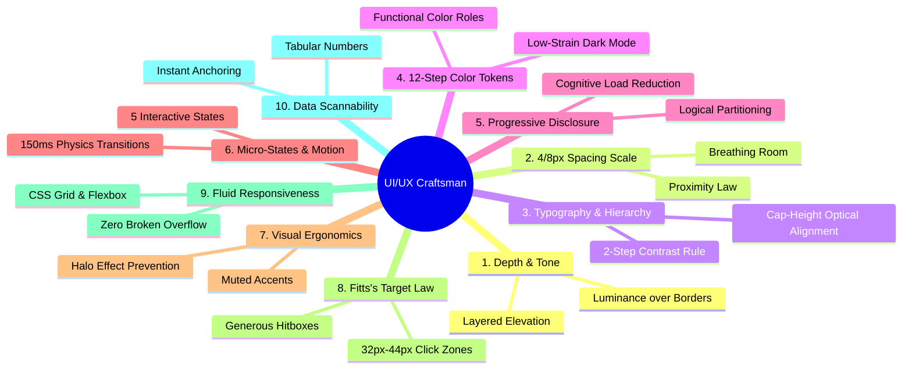

# UI/UX Craftsman: Top 10 Elite Web Design System

This skill equips the agent with senior-level UI/UX design heuristics, mathematical layout rules, visual ergonomics, and design-token systems to build clean, modern, and ergonomic interfaces.

---

## 🏛️ The Top 10 Battle-Tested Design Principles



---

### 1. Elevation & Depth through Tone/Luminance (Not Harsh Borders)
* **The Rule**: Never enclose every container with heavy, high-contrast borders. Build visual depth by stepping background luminance and applying subtle semi-transparent borders (`rgba(255, 255, 255, 0.05..0.08)` in dark mode).
* **Layer Hierarchy (Dark Mode)**:
  - `Base Canvas`: `#0f172a` (Deep background)
  - `Panel / Sidebar`: `#1e293b` (Subdued surface)
  - `Card / Row Container`: `#243248` or `#1e293b` with `1px solid rgba(255, 255, 255, 0.08)`
  - `Elevated Popover / Modal`: `#2a3b55` / `#1e293b` with `box-shadow: 0 10px 25px rgba(0, 0, 0, 0.5)`

### 2. Spacing Scale & Law of Proximity (4px/8px Geometric Scale)
* **The Rule**: Never use arbitrary pixel margins (`7px`, `13px`, `21px`). Use a strict geometric scale:
  - `2px` (micro), `4px` (tight), `8px` (compact), `12px` (standard), `16px` (comfortable), `24px` (loose), `32px` (spacious), `48px`/`64px` (sectional).
* **Law of Proximity**: Related items (title + description) must be closer (`4px-6px`) than the space between separate groups (`16px-24px`).

### 3. Typography: 2-Step Contrast Rule & Cap-Height Alignment
* **The Rule**: When changing visual priority between header and body, don't just change font size. Change size by 1 step, but change weight/color contrast by 2 steps.
* **Tracking Guidelines**:
  - Headings (`h1`, `h2`): `letter-spacing: -0.02em` to `-0.04em` (crisp, tight).
  - Small labels & Badges (`0.65rem-0.75rem`): `letter-spacing: +0.04em` to `+0.08em` + uppercase for legibility.
* **Optical Alignment**: Align icons to the cap-height of adjacent text, not the line-height container.

### 4. 12-Step Functional Color Token System (Radix/Tailwind Scale)
* **The Rule**: Never pick random hex codes. Structure every palette into 12 functional levels:
  - **Steps 1–2**: App backgrounds & canvas surfaces.
  - **Steps 3–5**: Interactive component backgrounds (`default`, `hover`, `active`).
  - **Steps 6–8**: Borders, subtle dividers, and focus rings.
  - **Steps 9–10**: Solid brand accents (primary CTAs, selected badges).
  - **Steps 11–12**: Accessible low-contrast (`#94a3b8`) and high-contrast (`#f8fafc`) text.

### 5. Progressive Disclosure & Cognitive Load Reduction
* **The Rule**: Group secondary and advanced actions behind hover states, dropdowns, or collapsible accordions.
* Separate terminal data fields (leaf elements) from category structures (branch elements) with distinct paragraph spacing.

### 6. Interactive Micro-States (The 5 States of UI)
* Every interactive control (button, chip, row, card, tab) must define all 5 states:
  1. `Default`: Resting state with subtle contrast.
  2. `Hover`: Slight lift (`transform: translateY(-1px)`), background brightening (`+5%`), border accent.
  3. `Active (Pressed)`: Slight scale down (`scale(0.98)`), pressed background.
  4. `Focus-Visible`: Prominent 2px focus ring with offset for keyboard navigation.
  5. `Disabled`: Opacity `0.45`, `cursor: not-allowed`, no hover/active transforms.
* Transition timing: `all 0.15s cubic-bezier(0.4, 0, 0.2, 1)`.

### 7. Visual Ergonomics & Contrast Softening
* **The Rule**: Prevent retinal eye strain during long sessions.
  - Never use pure `#ffffff` text on pure `#000000` backgrounds (causes glowing halo artifacts).
  - Primary text: `#f8fafc` or `#f1f5f9`.
  - Secondary text: `#94a3b8`.
  - Muted text / hints: `#64748b`.
  - Do not put bright, saturated colored left-borders on every item in long lists. Use soft pastel pill badges or subtle background tints.

### 8. Fitts's Target Law & Clickable Zones
* **The Rule**: Minimum touch/click target is `32px × 32px` on desktop and `44px × 44px` on mobile/touch.
* If an icon is `16px`, pad the wrapper button to `32px` so the user never mis-clicks.

### 9. Fluid Responsiveness (Zero Broken Overflows)
* **The Rule**: Use modern fluid CSS rather than rigid fixed widths:
  - `grid-template-columns: repeat(auto-fill, minmax(240px, 1fr))`
  - `min-width: min-content`, `width: 100%`, `overflow-x: auto`
  - Horizontal scrolling containers must have custom sleek scrollbars and padding to prevent cut-off shadows.

### 10. Data-Dense Yet Scannable Layouts
* **The Rule**: In dashboards, matrices, and tables:
  - Use `font-variant-numeric: tabular-nums` for aligned numbers.
  - Left-align text, right-align numbers, center-align status badges.
  - Badges: Translucent pastel backgrounds (`rgba(accent, 0.12)`) with saturated text (`#38bdf8`, `#34d399`, `#fbbf24`), rounded pills.

---

## 🎨 Quick CSS Implementation Blueprint

```css
/* Ergonomic Dark Theme Foundation */
:root {
    --bg-base: #0f172a;
    --bg-surface: #1e293b;
    --bg-surface-hover: #273549;
    --bg-card: #162032;
    
    --border-subtle: rgba(255, 255, 255, 0.08);
    --border-hover: rgba(56, 189, 248, 0.35);
    
    --text-primary: #f8fafc;
    --text-secondary: #94a3b8;
    --text-muted: #64748b;
    
    --accent-sky: #38bdf8;
    --accent-emerald: #34d399;
    --accent-amber: #fbbf24;
    
    --radius-sm: 6px;
    --radius-md: 10px;
    --radius-full: 9999px;
    
    --transition-fast: all 0.15s cubic-bezier(0.4, 0, 0.2, 1);
}

/* Card Component Example */
.craft-card {
    background-color: var(--bg-surface);
    border: 1px solid var(--border-subtle);
    border-radius: var(--radius-md);
    padding: 14px 16px;
    transition: var(--transition-fast);
}

.craft-card:hover {
    border-color: rgba(255, 255, 255, 0.16);
    box-shadow: 0 4px 12px rgba(0, 0, 0, 0.2);
}

/* Soft Badge Example */
.craft-badge-subtle {
    display: inline-flex;
    align-items: center;
    gap: 4px;
    font-size: 0.7rem;
    font-weight: 600;
    padding: 1px 7px;
    border-radius: var(--radius-full);
    background-color: rgba(56, 189, 248, 0.08);
    color: var(--accent-sky);
    border: 1px solid rgba(56, 189, 248, 0.2);
}
```

---

## 📋 Quality Inspection Checklist (Before Finalizing Any UI Task)

Before presenting any visual interface to the user, run through this mental checklist:
- [ ] **Contrast & Eye Strain**: Is any card or background glaringly bright or overly saturated?
- [ ] **Borders Check**: Can we replace heavy borders with subtle luminance shifts (`--bg-surface`) or `rgba(255,255,255,0.08)`?
- [ ] **Whitespace & Proximity**: Are related elements closer together than unrelated groups?
- [ ] **Typography Scale**: Are heading letter-spacings tight and badge letter-spacings tracked out?
- [ ] **Micro-States**: Are hover, active, focus-visible, and disabled states implemented with smooth 150ms transitions?
- [ ] **Responsiveness**: Does the layout gracefully wrap or scroll without clipping shadows or text?
