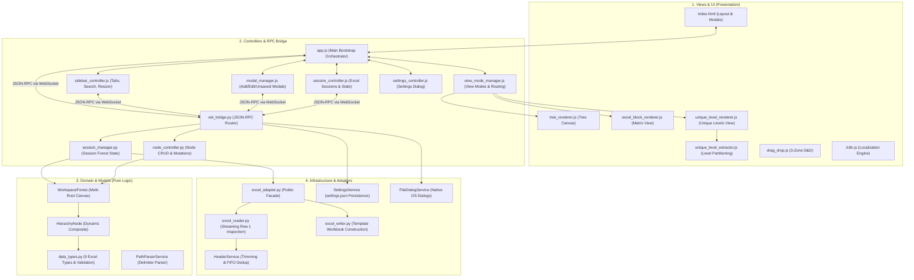

# Global System Map: Master Router & Architecture Hub

**Location**: `.specify/system_map.md` (and `.specify/system_map/router.md`)  
**Last Updated**: 2026-08-17  
**Architecture Style**: Modular MVC & Clean Architecture (C4 Model Level 1–2)  
**Governing Principle**: Constitution Principle VI (Modular System Map & Context Routing) & Principle VIII (200-Line Limit)

---

## 1. High-Level System Architecture (C4 Context & Container Diagram)

The application is an environment-independent Desktop GUI for modeling, restructuring, and persisting database hierarchies from and into Microsoft Excel (`.xlsx`) files.

---

## 2. Modular System Map Router (MVC Layer Breakdown)

To avoid bloated monolithic context files, the system map is modularized following the **MVC / Clean Architecture** paradigm. Click any link below to explore that layer:

| Architectural Layer | Modular Map File | Description & Contents | Primary Technologies |
|---|---|---|---|
| **1. Model / Domain** | [`.specify/system_map/domain_and_models.md`](system_map/domain_and_models.md) | Pure business logic, `HierarchyNode` dynamic composite, `data_types.py`, `WorkspaceForest`, `PathParserService`, cycle checks, DIP rules. | Python 3.10+ (Standard Library) |
| **2. View / Presentation** | [`.specify/system_map/views_and_ui.md`](system_map/views_and_ui.md) | `index.html` layout, Tree/Matrix/Unique Level renderers, `drag_drop.js`, `i18n.js` dictionaries, and `style.css` dark theme. | Vanilla HTML5, Vanilla JS (ES2022), CSS3 |
| **3. Controller & RPC** | [`.specify/system_map/controllers_and_rpc.md`](system_map/controllers_and_rpc.md) | Modular frontend sub-controllers (`modal_manager.js`, `sidebar_controller.js`, `view_mode_manager.js`, `session_controller.js`, `settings_controller.js`, `app.js`), `eel_bridge.py`, `session_manager.py`, and `node_controller.py`. | Python Eel, WebSocket JSON-RPC |
| **4. DTOs & Contracts** | [`.specify/system_map/dtos_and_contracts.md`](system_map/dtos_and_contracts.md) | Canonical JSON payload definitions (`HierarchyNodeDTO`, `SettingsDTO`, `ExcelSessionDTO`, `RejectionDTO`). | JSON Schema / DTOs |
| **5. Infrastructure & IO** | [`.specify/system_map/infrastructure_and_adapters.md`](system_map/infrastructure_and_adapters.md) | `ExcelHierarchyAdapter` facade delegating to `ExcelReader` (streaming inspection) and `ExcelWriter` (template generation), native OS dialogs, atomic `settings.json`. | openpyxl, Tkinter file dialogs |
| **6. State & Lifecycle** | [`.specify/system_map/state_and_lifecycle.md`](system_map/state_and_lifecycle.md) | Backend `SessionManager` (`sheet_forests`, `current_file_path`) and frontend state controllers (`SessionController.isDirty`, `collapsedNodeIds`). | In-Memory & `localStorage` |
| **7. Quality & Testing** | [`.specify/system_map/tests_and_quality.md`](system_map/tests_and_quality.md) | Complete 85+ test suite registry, automated AST architecture linters (including 200-line threshold checks), and frontend contract verification. | pytest, ast, Python unittest, Playwright |

---

## 3. Context-Aware Loading Guide for AI & Developers

When working on a specific task or feature, **DO NOT load all source files**. Follow this targeted context routing guide:

* 🎨 **Frontend UI / CSS / View Mode feature**: Load [`.specify/system_map/views_and_ui.md`](system_map/views_and_ui.md) + [`.specify/system_map/dtos_and_contracts.md`](system_map/dtos_and_contracts.md).
* ⚙️ **Backend logic / Excel parsing / Data types**: Load [`.specify/system_map/domain_and_models.md`](system_map/domain_and_models.md) + [`.specify/system_map/infrastructure_and_adapters.md`](system_map/infrastructure_and_adapters.md).
* 🌉 **New RPC endpoint / Settings / Bridge change**: Load [`.specify/system_map/controllers_and_rpc.md`](system_map/controllers_and_rpc.md) + [`.specify/system_map/dtos_and_contracts.md`](system_map/dtos_and_contracts.md).
* 🧠 **Multi-sheet session / Dirty state bug**: Load [`.specify/system_map/state_and_lifecycle.md`](system_map/state_and_lifecycle.md).
* 🧪 **Writing tests / Verifying boundaries**: Load [`.specify/system_map/tests_and_quality.md`](system_map/tests_and_quality.md).

---

## 4. Active System Health & Status Matrix

| Component / Layer | Status | Key Health Guarantee |
|---|:---:|---|
| **Dynamic Composite (`HierarchyNode`)** | 🟢 Active | Unifies folder/leaf dynamically; zero base class bloat. |
| **Data Types Module (`data_types.py`)** | 🟢 Active | Centralized 9 Excel types with case-insensitive validation (OCP). |
| **Multi-Root Forest (`WorkspaceForest`)** | 🟢 Active | Supports 3-zone insertion, cycle prevention, and leaf path resolution. |
| **Path Parser (`PathParserService`)** | 🟢 Active | Supports custom delimiters (`\`, `/`, `::`) with prefix branch merging. |
| **Excel Reader & Writer (`adapters/`)** | 🟢 Active | Modular `ExcelReader` (streaming, 0 data rows read) & `ExcelWriter` under `ExcelHierarchyAdapter` facade. |
| **Eel RPC Router & Sub-controllers (`src/app/`)** | 🟢 Active | Modular `eel_bridge.py`, `session_manager.py`, and `node_controller.py` ($\le 200$ lines). |
| **Frontend UI & Modular Sub-controllers (`src/web/`)** | 🟢 Active | 8 modular sub-controllers ($\le 200$ lines), 3 view modes, 2 languages, 0 dead CSS selectors. |
| **Test Suite (`pytest`)** | 🟢 Active | 85+ unit/integration tests passing in $< 1.5$s, 0 warnings, automated AST architecture linters. |
| **Legacy Models / Tests (`base.py`, etc.)** | 🔴 Retired | Completely deleted (Feature 029); enforced by linter. |
| **Monolithic Violations (> 200 lines)** | 🟢 Resolved | 100% of non-exempt source files strictly obey Constitution Principle VIII. |
