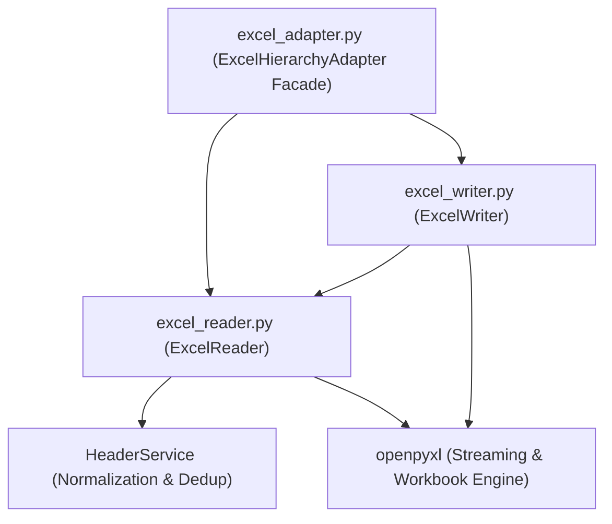

# Infrastructure & Adapters Layer: I/O, File System & OS Interop

**Path**: `.specify/system_map/infrastructure_and_adapters.md`  
**Architectural Layer**: Infrastructure / Adapters Layer  
**Governing Principles**: Constitution Principle V (Self-Contained Excel Processing) & Principle VIII (200-Line Thresholds)

---

## 1. Modular Excel Adapter Architecture (`src/hierarchy_lib/adapters/`)

The Excel processing layer is decomposed into dedicated, single-responsibility modules coordinated by a thin public facade:



### 1.1 `ExcelReader` ([`excel_reader.py`](file:///E:/JE/src/hierarchy_lib/adapters/excel_reader.py))
* **Streaming Header Inspection**: `read_row1_headers_and_types()` reads exclusively Row 1 with `consecutive_empty >= 10` cutoff. Ignores rows 2+ completely, minimizing memory/CPU overhead.
* **Format & Type Inference**: `map_format_to_data_type()` inspects cell `number_format`, column dimensions `number_format`, and `cell.data_type` strictly on Row 1 to map to one of the 9 standard Excel types.
* **Sheet Discovery**: `get_sheet_names()` returns all worksheets available in the workbook.

### 1.2 `ExcelWriter` ([`excel_writer.py`](file:///E:/JE/src/hierarchy_lib/adapters/excel_writer.py))
* **Multi-Sheet Template Generation**: `export_multi_sheet_template()` creates a fresh workbook with zero data rows (`max_row == 1`), applying openpyxl cell `number_format` formatting and writing leaf paths across Row 1 columns.
* **Type Format Map**:
```python
EXCEL_TYPE_FORMAT_MAP = {
    "Text": "@",
    "Integer": "0",
    "Decimal": "0.00",
    "Currency": '"$"#,##0.00',
    "Percentage": "0.00%",
    "Date": "yyyy-mm-dd",
    "Time": "hh:mm:ss",
    "DateTime": "yyyy-mm-dd hh:mm:ss",
    "Boolean": "General",
}
```

### 1.3 `ExcelHierarchyAdapter` ([`excel_adapter.py`](file:///E:/JE/src/hierarchy_lib/adapters/excel_adapter.py))
* Thin public facade ($\le 50$ lines) delegating to `ExcelReader` and `ExcelWriter`, maintaining 100% backwards compatibility for domain services and test suites.

---

## 2. File Dialog Service ([`dialog_service.py`](file:///E:/JE/src/hierarchy_lib/services/dialog_service.py))

* **File**: `src/hierarchy_lib/services/dialog_service.py`
* **Underlying Engine**: Python standard library `tkinter.filedialog`.
* **Guarantees**:
  * Spawns hidden Tkinter root window (`root.withdraw()`).
  * Brings dialogs to foreground on Windows (`root.attributes("-topmost", True)`).
  * Safely destroys root after dialog closure.
  * Returns `{ "success": true, "file_path": path, "canceled": bool }`.

---

## 3. Configuration File Persistence (`settings.json`)

* **Manager**: `SettingsService` in `src/hierarchy_lib/services/settings_service.py`.
* **Path**: `<repo_root>/settings.json`.
* **Guarantees**:
  * **Atomic Write**: Writes to `<path>.tmp` and executes atomic replace (`os.replace`) to prevent file corruption during power loss or abrupt termination.
  * **Safe Fallback**: If file is missing or corrupted, transparently falls back to default settings (`\` delimiter, `Text` default type).
