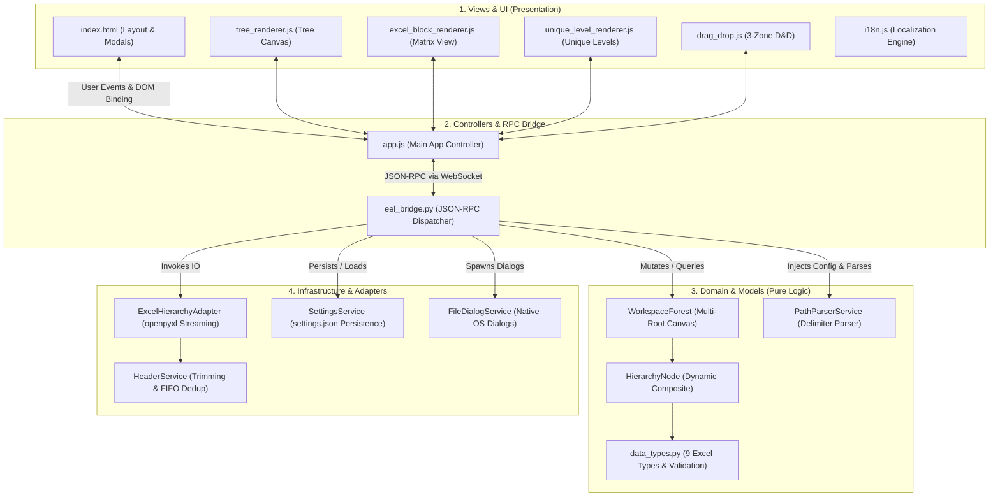

# Global System Map: Master Router & Architecture Hub

<!-- This file is a synchronized copy of .specify/system_map.md located inside the system_map/ directory -->

**Location**: `.specify/system_map/router.md` (and `.specify/system_map.md`)  
**Last Updated**: 2026-08-16  
**Architecture Style**: Modular MVC & Clean Architecture (C4 Model Level 1–2)  
**Governing Principle**: Constitution Principle VI (Modular System Map & Context Routing)

---

## 1. High-Level System Architecture (C4 Context & Container Diagram)

---

## 2. Modular System Map Router (MVC Layer Breakdown)

| Architectural Layer | Modular Map File | Description & Contents |
|---|---|---|
| **1. Model / Domain** | [`domain_and_models.md`](domain_and_models.md) | Pure business logic, `HierarchyNode` dynamic composite, `data_types.py`, `WorkspaceForest`, `PathParserService`, cycle checks, DIP rules. |
| **2. View / Presentation** | [`views_and_ui.md`](views_and_ui.md) | `index.html` layout, Tree/Matrix/Unique Level renderers, `drag_drop.js`, `i18n.js` dictionaries, and `style.css` dark theme. |
| **3. Controller & RPC** | [`controllers_and_rpc.md`](controllers_and_rpc.md) | `app.js` frontend controller, `@eel.expose` RPC endpoints in `eel_bridge.py`, event dispatchers, and application services. |
| **4. DTOs & Contracts** | [`dtos_and_contracts.md`](dtos_and_contracts.md) | Canonical JSON payload definitions (`HierarchyNodeDTO`, `SettingsDTO`, `ExcelSessionDTO`, `RejectionDTO`). |
| **5. Infrastructure & IO** | [`infrastructure_and_adapters.md`](infrastructure_and_adapters.md) | `ExcelHierarchyAdapter` (openpyxl streaming, Row 1 inspection, multi-sheet export), native OS dialogs, atomic `settings.json`. |
| **6. State & Lifecycle** | [`state_and_lifecycle.md`](state_and_lifecycle.md) | Backend multi-sheet session containers (`sheet_forests`, `current_file_path`) and frontend state (`isDirty`, `collapsedNodeIds`). |
| **7. Quality & Testing** | [`tests_and_quality.md`](tests_and_quality.md) | Complete 76-test suite registry, automated AST architecture linters, and frontend contract verification. |

---

## 3. Context-Aware Loading Guide for AI & Developers

* 🎨 **Frontend UI / CSS / View Mode feature**: Load [`views_and_ui.md`](views_and_ui.md) + [`dtos_and_contracts.md`](dtos_and_contracts.md).
* ⚙️ **Backend logic / Excel parsing / Data types**: Load [`domain_and_models.md`](domain_and_models.md) + [`infrastructure_and_adapters.md`](infrastructure_and_adapters.md).
* 🌉 **New RPC endpoint / Settings / Bridge change**: Load [`controllers_and_rpc.md`](controllers_and_rpc.md) + [`dtos_and_contracts.md`](dtos_and_contracts.md).
* 🧠 **Multi-sheet session / Dirty state bug**: Load [`state_and_lifecycle.md`](state_and_lifecycle.md).
* 🧪 **Writing tests / Verifying boundaries**: Load [`tests_and_quality.md`](tests_and_quality.md).
