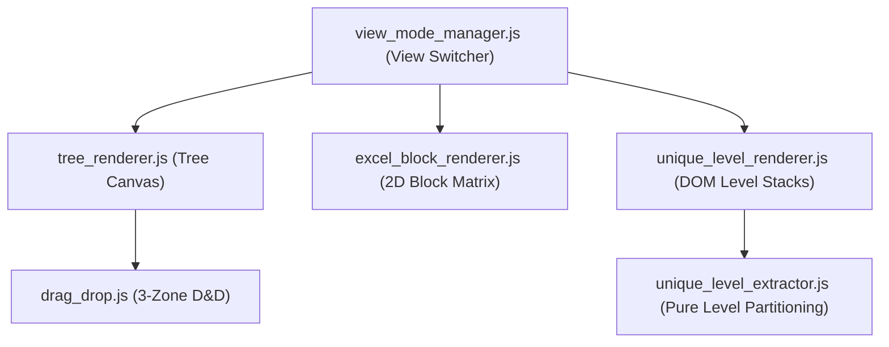

# Views & Presentation Layer: UI, Renderers & Styles

**Path**: `.specify/system_map/views_and_ui.md`  
**Architectural Layer**: View / Presentation Layer  
**Technologies**: Vanilla HTML5, Modular JavaScript (ES2022, $\le 200$ lines/file), Vanilla CSS3 (Dark Design System)

---

## 1. UI Layout & DOM Structure

### 1.1 [`index.html`](file:///E:/JE/src/web/index.html)
* **File**: `src/web/index.html`
* **Layout Architecture**: 2-Column Flexbox Desktop Layout:
  * **Top Navigation Bar (`.top-bar`)**:
    * Brand header & `#templateStatusBadge` (Bound template file indicator).
    * Toolbar actions: `#btnImportFile` (Import Excel), `#btnSaveSync` (Export Excel), `#btnRefreshExcel` (Refresh), `#btnSettings` (Settings Modal trigger).
    * Language Switcher (`.lang-switcher`): Dual-button segmented control (`#langBtnUk`, `#langBtnEn`).
  * **Main Workspace Canvas (`.workspace-panel` - Left Column)**:
    * Workspace Header: Inline Sheet Picker (`#activeSheetSelector`), Node Count Badge (`#nodeCountBadge`), View Mode Switcher (`#viewModeSwitcher`: Tree `#btnViewTree`, Matrix `#btnViewMatrix`, Unique Levels `#btnViewUniqueLevels`), Root Node Creator (`#btnAddRootHeader`), and Expand/Collapse All buttons (`#btnExpandAll`, `#btnCollapseAll`).
    * Canvas Views Container:
      1. Tree View (`#treeView`): Nested dynamic node cards with Drag & Drop.
      2. Excel Block Matrix View (`#excelBlockView`): 2D spreadsheet block table.
      3. Unique Levels View (`#uniqueLevelView`): Horizontal stacked level rows with cross-level duplicate badges.
    * Empty State (`#emptyState`): Clean-slate prompt with `#btnCreateRootEmpty`.
  * **Unified Resizable Sidebar (`#unifiedSidebar` - Right Column)**:
    * Left-edge Draggable Splitter Handle (`#sidebarResizer`).
    * Compact Tab Selector Dropdown (`#sidebarTabSelector`): `Catalog` (with `#headerCountBadge`) vs `Export Preview` (with `#pathCountBadge`).
    * Catalog Browser: Focused Sheet Selector (`#catalogSheetSelector` with `__ALL__` combined view), Header cards with data type tags (`.header-type-tag`) and sheet origin tags.
    * Export Preview: Live generated leaf path cards with data type badges.
    * Persistent Collapse Toggle (`#btnToggleSidebarCollapse`) and Collapsed Strip (`.sidebar-collapsed-strip`, 28px).
  * **Modal Dialogs**:
    * Node Add & Edit Modal (`#editModal`): Name text input, `#selectNodeType` data type dropdown, `#folderTypeHint`, `#modalBatchNotice`.
    * Settings Modal (`#settingsModal`): Path delimiter input (1–3 chars), default Excel data type dropdown, Save, Cancel, and Reset Defaults buttons.
    * Unsaved Changes Modal (`#unsavedModal`): Confirmation dialog on sheet switch or file import when `isDirty` is true.

---

## 2. Specialized Renderers & Extractors (`src/web/js/`)

### 2.1 [`tree_renderer.js`](file:///E:/JE/src/web/js/tree_renderer.js)
* **Role**: Renders dynamic `HierarchyNode` trees into collapsible nested DOM elements.
* Evaluates folder vs leaf strictly based on `node.children.length > 0`.
* Renders interactive chevron toggle (`.node-toggle`) with persistent collapse state via `collapsedNodeIds`.

### 2.2 [`excel_block_renderer.js`](file:///E:/JE/src/web/js/excel_block_renderer.js)
* **Role**: Translates `WorkspaceForest` trees into a 2D multi-tier Excel block matrix table (`#excelBlockView`).
* Computes tree depth, leaf column counts, and column letters (A, B, C...).
* Applies horizontal `colspan` to parent catalog blocks and vertical `rowspan` to leaves.

### 2.3 [`unique_level_extractor.js`](file:///E:/JE/src/web/js/unique_level_extractor.js)
* **Role**: Pure data extraction service partitioning tree nodes into Level 1..N groups.
* Performs leaf-first partitioning (`leaves` vs `branches`), deduplication, occurrence counting, and cross-level match detection.

### 2.4 [`unique_level_renderer.js`](file:///E:/JE/src/web/js/unique_level_renderer.js)
* **Role**: Deconstructs trees into horizontal stacked level rows of deduplicated header terms (`#uniqueLevelView`).
* Renders leaf/branch subgroups with counts, cross-level match badges, and interactive hover synchronization (`.highlight-match-sync`).

### 2.5 [`drag_drop.js`](file:///E:/JE/src/web/js/drag_drop.js)
* **Role**: Implements 3-zone drag & drop hit testing (`BEFORE_SIBLING`, `AFTER_SIBLING`, `NEST_CHILD`).
* Drop indicators, cycle prevention detection, and cross-zone insertion payloads.

---

## 3. Localization & Styling

### 3.1 [`i18n.js`](file:///E:/JE/src/web/js/i18n.js)
* **Role**: Centralized bilingual localization engine (Ukrainian `uk` default, English `en`).
* Key methods: `I18n.t()`, `I18n.getTypeLabel()`, `I18n.translateDOM()`, `I18n.onLanguageChanged()`.

### 3.2 Styling System ([`style.css`](file:///E:/JE/src/web/css/style.css) & [`drag_drop.css`](file:///E:/JE/src/web/css/drag_drop.css))
* Dark theme design system (HSL tailored colors, 0 dead CSS classes).
