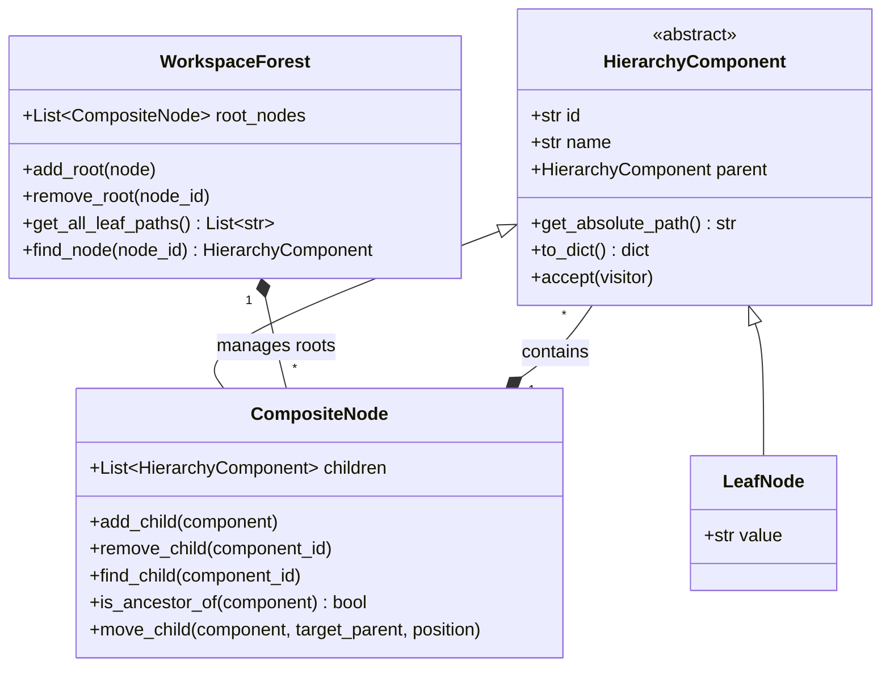

# Phase 1 Data Model & Architecture Design: Database Hierarchy Creator

## Domain Model (GoF Composite Pattern)

---

## Entity Descriptions & Data Contracts

### 1. `HierarchyComponent` (Abstract Base Class)
- **Attributes**:
  - `id`: `str` (UUIDv4 unique identifier)
  - `name`: `str` (Node segment name, sanitized without unescaped `\`)
  - `parent`: `Optional[CompositeNode]` (Reference to parent container, `None` if root)
- **Methods**:
  - `get_absolute_path()`: Traverses `parent` pointers recursively up to root, building backslash-joined path string (`Root\Folder\Subfolder\Item`).

### 2. `CompositeNode` (Container Class)
- **Attributes**: Inherits from `HierarchyComponent`.
  - `children`: `List[HierarchyComponent]` (Ordered list of child components)
- **Methods**:
  - `add_child(child: HierarchyComponent)`: Appends child, updating `child.parent = self`.
  - `remove_child(child_id: str)`: Removes child and sets its `parent = None`.
  - `is_ancestor_of(node: HierarchyComponent) -> bool`: Checks if `self` is an ancestor of `node` to prevent cycle creation.

### 3. `LeafNode` (Terminal Node Class)
- **Attributes**: Inherits from `HierarchyComponent`.
  - Terminal node representing an individual item at the leaf level.

### 4. `WorkspaceForest` (Root Container)
- **Attributes**:
  - `root_nodes`: `List[CompositeNode]` (List of top-level root nodes)
- **Methods**:
  - `get_all_leaf_paths()`: Returns all calculated leaf path strings across all roots in the forest.

---

## Excel Data Mapping Protocol (`openpyxl`)

### Import Mapping (Sheet Row 1 -> Composite Nodes)
1. **Source**: Each worksheet in an `.xlsx` workbook.
2. **Reading**: Extract `sheet.cell(row=1, column=1).value`.
3. **Parsing**:
   - Split value on `\` into path segments: `["Root", "Folder", "Item"]`.
   - Traverse/create root node `"Root"`.
   - Traverse/create container node `"Folder"` under `"Root"`.
   - Create leaf node `"Item"` under `"Folder"`.

### Export Mapping (Composite Nodes -> Excel Columns/Rows)
1. **Destination**: New `.xlsx` workbook.
2. **Writing**: For each path in `WorkspaceForest.get_all_leaf_paths()`:
   - Split path into segments `["Root", "Folder", "Item"]`.
   - Write Segment 1 ("Root") to Sheet Row 1, Column A.
   - Write Segment 2 ("Folder") to Sheet Row 2, Column A.
   - Write Segment 3 ("Item") to Sheet Row 3, Column A.
   - (Strictly one path segment per cell, one segment per row).
