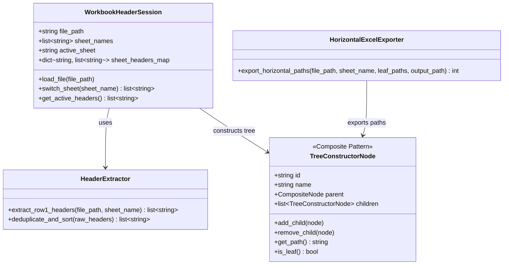

# Data Model & Domain Entities: Excel Header Reorganization

**Feature**: `002-excel-sidebar-reorganizer`  
**Date**: 2026-08-13  
**Status**: Complete  

---

## Core Domain Entities

---

### Entity Definitions

#### 1. `WorkbookHeaderSession`
- **Description**: In-memory domain session managing an imported Excel workbook's sheets and header cache.
- **Attributes**:
  - `file_path` (`str`): Absolute file system path to the imported `.xlsx` file.
  - `sheet_names` (`list[str]`): List of sheet names available in the workbook.
  - `active_sheet` (`str`): Name of the currently selected sheet.
  - `sheet_headers_map` (`dict[str, list[str]]`): Cached map of unique, sorted header lists keyed by sheet name.
- **Methods**:
  - `load_file(path)`: Initializes session, parses sheets and pre-extracts/caches headers.
  - `switch_sheet(name)`: Updates `active_sheet` and returns corresponding header list.

#### 2. `HeaderExtractor`
- **Description**: Utility service for reading Row 1 cells and processing header lists.
- **Rules**:
  - Reads exclusively Row 1 (`max_row=1`).
  - Trims whitespace from cell strings.
  - Excludes empty/blank cells.
  - Deduplicates duplicate header values.
  - Sorts unique headers in case-insensitive alphabetical order.

#### 3. `TreeConstructorNode` (Composite Pattern)
- **Description**: Domain model representation of nodes built in the workspace editor canvas.
- **Attributes**:
  - `id` (`str`): Unique UUID or string identifier for the canvas node.
  - `name` (`str`): Header or folder label string.
  - `children` (`list[TreeConstructorNode]`): Child nodes (if composite container).
- **Behavior**:
  - `get_path()`: Recursively constructs path string separated by backslashes (`\`).
  - `is_leaf()`: Returns `True` if `children` list is empty.

#### 4. `HorizontalExcelExporter`
- **Description**: Adapter service for writing tree leaf paths horizontally across Row 1 columns.
- **Behavior**:
  - Opens target `.xlsx` workbook.
  - Accesses worksheet matching `sheet_name`.
  - Clears existing Row 1 headers or overwrites starting from Column 1 (Cell `A1`).
  - Writes leaf path strings into sequential columns (`A1`, `B1`, `C1`, ...).
  - Saves workbook to output path.
