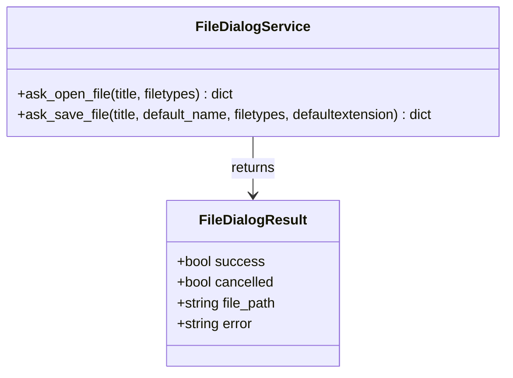

# Data Model & Domain Entities: Native Desktop File Dialogs

**Feature**: `003-native-file-dialogs`  
**Date**: 2026-08-13  
**Status**: Complete  

---

## Core Domain Entities

---

### Entity Definitions

#### 1. `FileDialogService`
- **Description**: Service encapsulating `tkinter.filedialog` operations with root window suppression and topmost focus management.
- **Methods**:
  - `ask_open_file(title="Select Excel File", filetypes=[("Excel Files", "*.xlsx"), ("All Files", "*.*")]) -> Dict[str, Any]`:
    - Opens native OS file selection dialog.
    - Suppresses root window (`withdraw()`).
    - Returns result dictionary containing `cancelled` status and `file_path`.
  - `ask_save_file(title="Save Reorganized Excel File", default_name="reorganized_headers_export.xlsx", defaultextension=".xlsx") -> Dict[str, Any]`:
    - Opens native OS save file dialog.
    - Suppresses root window (`withdraw()`).
    - Returns result dictionary containing `cancelled` status and `file_path`.

#### 2. `FileDialogResult` Payload Schema
- `success` (`bool`): `True` if operation completed without exception.
- `cancelled` (`bool`): `True` if user clicked Cancel or closed the file dialog.
- `file_path` (`Optional[str]`): Absolute path chosen by user, or `None` if cancelled.
- `error` (`Optional[str]`): Error message if an exception occurred during invocation.
