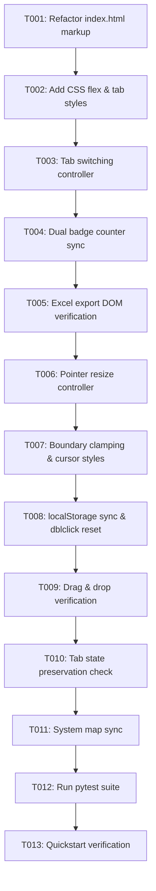

# Task Breakdown: Unified Tabbed Sidebar & Draggable Left-Edge Resizing

**Feature**: `013-unified-sidebar-tabs-resize`  
**Branch**: `013-unified-sidebar-tabs-resize`  
**Spec**: [specs/013-unified-sidebar-tabs-resize/spec.md](spec.md)  
**Plan**: [specs/013-unified-sidebar-tabs-resize/plan.md](plan.md)  

---

## Format: `[ID] [P?] [Story] Description`
- **[P]**: Can run in parallel
- **[Story]**: Target User Story (US1, US2, US3)

---

## Phase 1: Setup & Foundational (DOM & Design Tokens)

**Purpose**: Establish the 2-column layout markup and core CSS styling.

- [x] T001 Refactor `src/web/index.html` from 3-panel workspace to 2-column flex layout (`.tree-panel` on the left, `<section class="panel unified-sidebar-panel" id="unifiedSidebar">` on the right with `#sidebarResizer`, `.sidebar-tab-header`, `#tabBtnCatalog`, `#tabBtnPaths`, `#tabContentCatalog`, and `#tabContentPaths`, preserving all inner IDs)
- [x] T002 Update `src/web/css/style.css` to define 2-column flexbox workspace layout, tab buttons, active indicators, `.resizer-handle-left`, and `body.is-resizing` rules

**Checkpoint**: Base 2-column layout structure and CSS tokens are in place.

---

## Phase 2: User Story 1 - Unified Tabbed Side Panel with View Switching (Priority: P1) 🎯 MVP

**Goal**: Consolidate Header Catalog and Leaf Paths into a single tabbed sidebar with instantaneous view toggling, live dual-badge counters, and continuous Row 1 export capability.

**Independent Test**: Launch application, verify single right-hand sidebar with two tabs ("Header Catalog" and "Leaf Paths"). Toggle tabs to verify instantaneous switching. Import Excel sheet and verify both `#headerCountBadge` and `#pathCountBadge` update simultaneously. Click "Export Excel" from the Catalog tab and verify export succeeds without DOM errors.

- [x] T003 [US1] Implement tab switching controller in `src/web/js/app.js` (`bindTabs` to toggle `.active` on tab buttons and `.hidden` on `#tabContentCatalog` / `#tabContentPaths`, defaulting to catalog)
- [x] T004 [US1] Wire live dual-counter badge updates (`#headerCountBadge` and `#pathCountBadge`) in `src/web/js/app.js` across tree refresh, file import, and sheet switching
- [x] T005 [US1] Verify that `handleExportReorganizedRow1` in `src/web/js/app.js` accurately reads `.path-card` elements from `#pathList` in the DOM regardless of which tab is active

**Checkpoint**: User Story 1 is fully functional and independently testable as an MVP.

---

## Phase 3: User Story 2 - Draggable Left-Edge Panel Resizing with Persistence (Priority: P2)

**Goal**: Enable smooth horizontal left-edge dragging on the unified sidebar with clamped boundary limits, double-click reset to 340px, and `localStorage` persistence.

**Independent Test**: Hover over left edge of sidebar to see `col-resize` cursor and accent highlight. Drag left/right to resize sidebar smoothly while canvas adjusts. Verify min 260px and max viewport clamps. Double-click handle to reset to 340px. Refresh window and verify custom width is preserved from `localStorage`.

- [x] T006 [US2] Implement `SidebarResizeController` in `src/web/js/app.js` attaching pointer event handlers (`pointerdown`, `pointermove`, `pointerup`) to `#sidebarResizer`
- [x] T007 [US2] Implement boundary clamping logic (min 260px, max 70vw / min 320px tree canvas) and `is-resizing` class management on `document.body` in `src/web/js/app.js` and `src/web/css/style.css`
- [x] T008 [US2] Implement `localStorage` width persistence (`app_sidebar_width`, fallback: 340px) and double-click reset to 340px on `#sidebarResizer` in `src/web/js/app.js`

**Checkpoint**: User Stories 1 and 2 are both independently functional and integrated.

---

## Phase 4: User Story 3 - Full Drag-and-Drop & State Preservation Across Tabs (Priority: P3)

**Goal**: Guarantee zero regressions to non-destructive drag-and-drop into tree canvas, real-time search filtering, and sheet manager dropdown state across tab switches.

**Independent Test**: Type a query into the Header Catalog search box, switch to Leaf Paths tab, switch back, and verify search input and filtered items remain intact. Drag a header item from the catalog into the tree canvas and verify 3-zone node insertion functions properly.

- [x] T009 [US3] Verify non-destructive drag-and-drop from `#sidebarHeaderList` into `#treeView` across all 3 zones (`BEFORE_SIBLING`, `AFTER_SIBLING`, `NEST_CHILD`) without interference from resize pointer handlers
- [x] T010 [US3] Verify real-time search filter (`#sidebarSearch`) and sheet selector state (`#sheetSelector`) are preserved intact when toggling between tabs

**Checkpoint**: All three user stories are completely functional with zero regressions.

---

## Phase 5: Polish, System Map Sync & Quality Assurance

**Purpose**: Synchronize documentation and validate full automated and manual test suites.

- [x] T011 Update [`.specify/system_map.md`](../../.specify/system_map.md) to document the 2-column workspace layout, unified tabbed sidebar component, and left-edge resizer
- [x] T012 Run full test suite `python -m pytest` to confirm all 47+ unit and integration tests pass cleanly with 0 failures
- [x] T013 Execute end-to-end manual verification per [`specs/013-unified-sidebar-tabs-resize/quickstart.md`](quickstart.md)

---

## Dependencies & Execution Order

