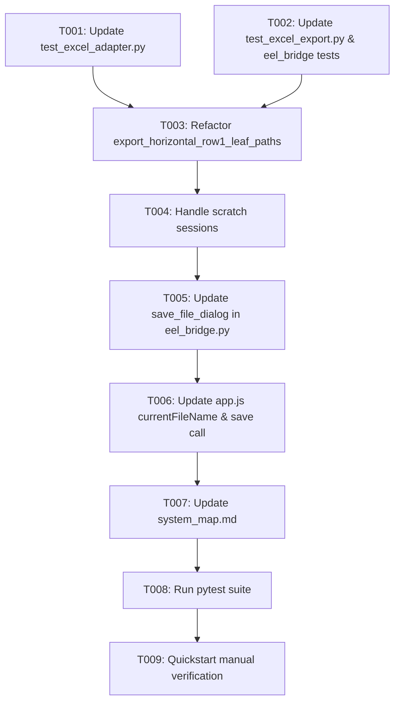

# Task Breakdown: Full-Workbook Header Template Export via Clean Workbook Construction (`Шаблон_...xlsx`)

**Feature**: `014-export-headers-only-clean-workbook`  
**Branch**: `014-export-headers-only-clean-workbook`  
**Spec**: [specs/014-export-headers-only-clean-workbook/spec.md](spec.md)  
**Plan**: [specs/014-export-headers-only-clean-workbook/plan.md](plan.md)  

---

## Format: `[ID] [P?] [Story] Description`
- **[P]**: Can run in parallel
- **[Story]**: Target User Story (US1, US2)

---

## Phase 1: Setup & Test Updates (TDD)

**Purpose**: Update test suites to assert clean from-scratch workbook generation and `Шаблон_` filename prefixing before modifying core code.

- [x] T001 [P] [US1] Update unit tests in `tests/unit/test_excel_adapter.py` to assert that `export_horizontal_row1_leaf_paths` creates a clean workbook containing all sheets from the source file with Row 1 headers only and zero data rows (`max_row == 1` across all sheets)
- [x] T002 [P] [US1/US2] Update unit tests in `tests/unit/test_excel_export.py` and integration tests in `tests/integration/test_eel_bridge.py` to assert clean template output and `Шаблон_` save dialog filename proposal

**Checkpoint**: Tests reflect the new template-from-scratch requirements and fail against the legacy row-preserving code.

---

## Phase 2: User Story 1 - Resource-Efficient Clean Template Workbook Construction (Priority: P1) 🎯 MVP

**Goal**: Refactor `export_horizontal_row1_leaf_paths` to build a clean `openpyxl.Workbook()` from scratch with multi-sheet preservation and zero data rows.

**Independent Test**: Export a multi-sheet file with thousands of data rows; confirm export completes in < 100ms producing a clean `.xlsx` where all sheets exist with `max_row == 1`.

- [x] T003 [US1] Refactor `ExcelHierarchyAdapter.export_horizontal_row1_leaf_paths` in `src/hierarchy_lib/adapters/excel_adapter.py` to instantiate a fresh `openpyxl.Workbook()`, retrieve all sheet names, populate target sheet Row 1 with `leaf_paths`, stream other sheets' Row 1 headers via `read_row1_headers`, and save to `output_path`
- [x] T004 [US1] Handle scratch sessions in `export_horizontal_row1_leaf_paths` when no source file exists by creating a single-sheet workbook with `sheet_name` and Row 1 leaf paths

**Checkpoint**: User Story 1 is fully functional and independently testable as an MVP.

---

## Phase 3: User Story 2 - Default Export Filename with `Шаблон_` Prefix (Priority: P2)

**Goal**: Format proposed save filename with `Шаблон_<original_basename>.xlsx` in native save dialog.

**Independent Test**: Load `Test_Data.xlsx`, click "Export Excel", and verify the save dialog suggests `Шаблон_Test_Data.xlsx`.

- [x] T005 [US2] Update `save_file_dialog` endpoint in `src/app/eel_bridge.py` to propose `Шаблон_<basename>.xlsx` when `current_file_path` is active (fallback: `Шаблон_reorganized_headers_export.xlsx`)
- [x] T006 [US2] Update `src/web/js/app.js` to track `this.currentFileName` on `handleImportExcelFile` and pass `Шаблон_${this.currentFileName}` to `eel.save_file_dialog()` upon export

**Checkpoint**: User Stories 1 and 2 are both fully functional and integrated.

---

## Phase 4: Polish, System Map Sync & Quality Assurance

**Purpose**: Synchronize system map and validate full automated and manual test suites.

- [x] T007 Update [`.specify/system_map.md`](../../.specify/system_map.md) to document clean from-scratch multi-sheet template export and `Шаблон_` filename formatting
- [x] T008 Run full test suite `python -m pytest` to confirm all unit and integration tests pass cleanly with 0 failures
- [x] T009 Execute end-to-end manual verification per [`specs/014-export-headers-only-clean-workbook/quickstart.md`](quickstart.md)

---

## Dependencies & Execution Order

