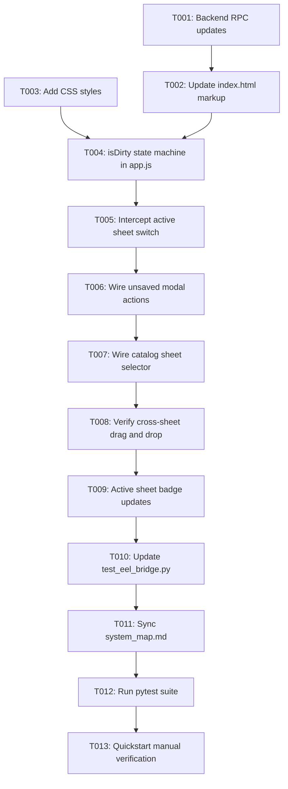

# Task Breakdown: Intuitive Sheet Management, Unsaved Changes Protection & Cross-Sheet Header Catalog

**Feature**: `015-sheet-manager-save-prompt-and-cross-sheet-catalog`  
**Branch**: `015-sheet-manager-save-prompt-and-cross-sheet-catalog`  
**Spec**: [specs/015-sheet-manager-save-prompt-and-cross-sheet-catalog/spec.md](spec.md)  
**Plan**: [specs/015-sheet-manager-save-prompt-and-cross-sheet-catalog/plan.md](plan.md)  

---

## Format: `[ID] [P?] [Story] Description`
- **[P]**: Can run in parallel
- **[Story]**: Target User Story (US1, US2, US3)

---

## Phase 1: Setup & Foundational (Markup, CSS & RPC)

**Purpose**: Establish backend multi-sheet header APIs, DOM elements, and CSS tokens.

- [x] T001 [P] Update `src/app/eel_bridge.py` to return `all_headers` in `import_excel_file` and expose `get_sheet_headers(sheet_name)` RPC endpoint
- [x] T002 Refactor `src/web/index.html` to add `#activeSheetBadge` in the workspace header, decouple `#activeSheetSelector` from `#catalogSheetSelector` in the sidebar, relabel Tab 2 button to `Export Preview`, and add `#unsavedModal` markup
- [x] T003 [P] Update `src/web/css/style.css` with styling for `.badge-sheet`, `.form-help-text`, and `#unsavedModal` buttons

**Checkpoint**: Base markup, styles, and RPC endpoints are ready for state machine integration.

---

## Phase 2: User Story 1 - Unsaved Changes Protection on Active Sheet Switch (Priority: P1) 🎯 MVP

**Goal**: Implement `isDirty` state tracking and sheet switch confirmation modal to prevent accidental data loss.

**Independent Test**: Add a node to sheet `Sales`, select `Inventory` in `#activeSheetSelector`, confirm modal appears. Click `Cancel` to verify canvas remains on `Sales`. Click `Discard & Switch` to verify workspace cleanly loads `Inventory`.

- [x] T004 [US1] Implement `isDirty` state tracking in `src/web/js/app.js` (set `true` on node add, move, delete; reset `false` on import, save, discard)
- [x] T005 [US1] Implement dirty state interception on `#activeSheetSelector` change in `src/web/js/app.js` to open `#unsavedModal` when `isDirty == true`
- [x] T006 [US1] Wire `#unsavedModal` button handlers in `src/web/js/app.js` (Cancel: revert selector and retain canvas; Discard & Switch: reset dirty and switch sheet; Save & Switch: export workbook and switch sheet)

**Checkpoint**: User Story 1 is fully functional and independently testable as an MVP.

---

## Phase 3: User Story 2 - Cross-Sheet Header Catalog Browsing without Canvas Reset (Priority: P2)

**Goal**: Allow browsing and dragging headers from any sheet in the workbook without resetting or reloading the active workspace canvas.

**Independent Test**: With `Sales` active on canvas, select `Inventory` in `#catalogSheetSelector`. Confirm sidebar catalog shows headers from `Inventory` while canvas stays on `Sales`. Drag a header from `Inventory` into `Sales` tree.

- [x] T007 [US2] Wire `#catalogSheetSelector` in `src/web/js/app.js` to filter and display headers from the selected sheet (or `All Sheets`) in `#sidebarHeaderList` without altering the canvas tree
- [x] T008 [US2] Verify non-destructive drag-and-drop from cross-sheet catalog items into the active workspace tree in `src/web/js/app.js` and mark workspace as dirty

**Checkpoint**: User Stories 1 and 2 are both fully functional and integrated.

---

## Phase 4: User Story 3 - Visual Hierarchy & Context Clarity (Priority: P3)

**Goal**: Display prominent active sheet indicator and self-explanatory labels for first-time users.

**Independent Test**: Load a file and confirm `#activeSheetBadge` displays `Active Sheet: <sheetName>`, updating dynamically on sheet switch.

- [x] T009 [US3] Update `#activeSheetBadge` text dynamically in `src/web/js/app.js` on file import and active sheet switch

**Checkpoint**: All three user stories are complete and fully polished.

---

## Phase 5: Polish, System Map Sync & Quality Assurance

**Purpose**: Update tests, synchronize system map, and validate full test suites.

- [x] T010 Update integration tests in `tests/integration/test_eel_bridge.py` to verify `all_headers` and `get_sheet_headers` RPC endpoints
- [x] T011 Update [`.specify/system_map.md`](../../.specify/system_map.md) to document dual-selector sheet management and dirty state lifecycle
- [x] T012 Run full test suite `python -m pytest` to confirm all unit and integration tests pass cleanly with 0 failures
- [x] T013 Execute end-to-end manual verification per [`specs/015-sheet-manager-save-prompt-and-cross-sheet-catalog/quickstart.md`](quickstart.md)

---

## Dependencies & Execution Order

