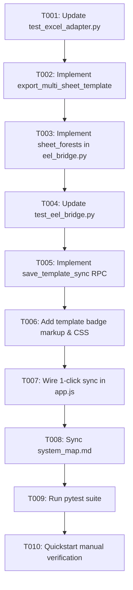

# Task Breakdown: Multi-Sheet Session Persistence & Template Auto-Sync

**Feature**: `016-multi-sheet-session-persistence-and-template-sync`  
**Branch**: `016-multi-sheet-session-persistence-and-template-sync`  
**Spec**: [specs/016-multi-sheet-session-persistence-and-template-sync/spec.md](spec.md)  
**Plan**: [specs/016-multi-sheet-session-persistence-and-template-sync/plan.md](plan.md)  

---

## Format: `[ID] [P?] [Story] Description`
- **[P]**: Can run in parallel
- **[Story]**: Target User Story (US1, US2)

---

## Phase 1: Setup & Foundational (TDD Tests & Core Adapter)

**Purpose**: Build and test multi-sheet template export at the core adapter level.

- [x] T001 [P] Update unit tests in `tests/unit/test_excel_adapter.py` to assert that `export_multi_sheet_template` exports custom leaf paths for multiple sheets simultaneously into Row 1 with `max_row == 1` and streams original headers for unedited sheets
- [x] T002 Refactor `ExcelHierarchyAdapter` in `src/hierarchy_lib/adapters/excel_adapter.py` to implement `export_multi_sheet_template(file_path, sheet_leaf_paths_map, output_path)` and delegate `export_horizontal_row1_leaf_paths`

**Checkpoint**: Core domain can export multi-sheet templates with varying leaf paths across sheets.

---

## Phase 2: User Story 1 - Multi-Sheet Session Hierarchy Persistence (Priority: P1) 🎯 MVP

**Goal**: Persist independent `WorkspaceForest` trees per sheet in backend memory across sheet switches.

**Independent Test**: Modify Sheet A, switch to Sheet B, modify Sheet B, switch back to Sheet A; confirm Sheet A's modified hierarchy is 100% restored.

- [x] T003 [US1] Update `src/app/eel_bridge.py` to maintain `sheet_forests: Dict[str, WorkspaceForest]` across all workbook sheets, retaining modified tree states upon `switch_active_sheet`
- [x] T004 [US1] Update integration tests in `tests/integration/test_eel_bridge.py` to verify multi-sheet persistence across round-trip sheet switches

**Checkpoint**: User Story 1 is fully functional and independently testable as an MVP.

---

## Phase 3: User Story 2 - Bound Template File Auto-Sync & Streamlined Update Prompt (Priority: P2)

**Goal**: Bind `current_template_path` and provide 1-click template update during sheet switching without reopening the OS file picker.

**Independent Test**: Save a template file `Шаблон_Data.xlsx`, switch sheets, modify nodes, trigger switch, click `Update Template & Switch`; confirm template file updates without file dialog.

- [x] T005 [US2] Implement `save_template_sync(output_path: Optional[str])` RPC endpoint in `src/app/eel_bridge.py` that computes leaf paths across all `sheet_forests`, exports via `export_multi_sheet_template`, and binds `current_template_path`
- [x] T006 [US2] [P] Update `src/web/index.html` and `src/web/css/style.css` with `#templateStatusBadge` (`.badge-template`) in the header toolbar
- [x] T007 [US2] Update `src/web/js/app.js` to manage `this.currentTemplatePath`, dynamically update `#templateStatusBadge`, and configure the Unsaved Changes modal for 1-click `[Update Template & Switch]`

**Checkpoint**: User Stories 1 and 2 are fully functional and integrated.

---

## Phase 4: Polish, System Map Sync & Quality Assurance

**Purpose**: Update system map and validate full automated and manual test suites.

- [x] T008 Update [`.specify/system_map.md`](../../.specify/system_map.md) to document the multi-sheet session container (`sheet_forests`) and template auto-sync lifecycle
- [x] T009 Run full test suite `python -m pytest` to confirm all unit and integration tests pass cleanly with 0 failures
- [x] T010 Execute end-to-end manual verification per [`specs/016-multi-sheet-session-persistence-and-template-sync/quickstart.md`](quickstart.md)

---

## Dependencies & Execution Order

