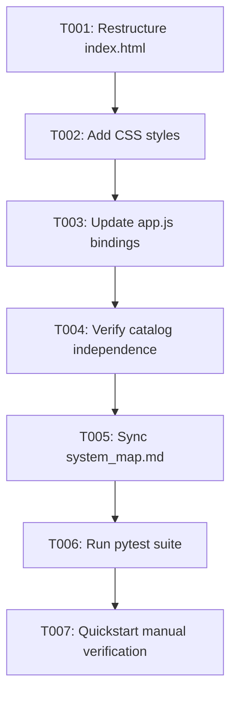

# Task Breakdown: Move Active Workspace Sheet Selector to Canvas Workspace

**Feature**: `017-move-active-sheet-selector-to-canvas-workspace`  
**Branch**: `017-move-active-sheet-selector-to-canvas-workspace`  
**Spec**: [specs/017-move-active-sheet-selector-to-canvas-workspace/spec.md](spec.md)  
**Plan**: [specs/017-move-active-sheet-selector-to-canvas-workspace/plan.md](plan.md)  

---

## Format: `[ID] [P?] [Story] Description`
- **[P]**: Can run in parallel
- **[Story]**: Target User Story (US1, US2)

---

## Phase 1: Setup & Foundational (Markup & CSS)

**Purpose**: Restructure HTML markup and implement CSS styles for the inline canvas header selector.

- [x] T001 [P] Refactor `src/web/index.html` to embed `.workspace-sheet-picker` with `<select id="activeSheetSelector">` into `.tree-panel .panel-header .panel-title-group` and remove redundant selector from `#tabContentCatalog`
- [x] T002 [P] Update `src/web/css/style.css` with styling for `.workspace-sheet-picker`, `.workspace-sheet-label`, and `.workspace-sheet-select`

**Checkpoint**: Canvas header displays the styled inline sheet dropdown and sidebar displays only the catalog dropdown.

---

## Phase 2: User Story 1 - Direct Active Sheet Switching on Workspace Canvas (Priority: P1) 🎯 MVP

**Goal**: Enable active sheet switching directly from the canvas header with full dirty-state protection.

**Independent Test**: Load a file with `Sales` and `Inventory`. Change the canvas header `Sheet:` dropdown to `Inventory`, confirm canvas loads `Inventory`. Add a node to `Inventory`, attempt switch to `Sales`, confirm Unsaved Changes modal appears.

- [x] T003 [US1] Update `src/web/js/app.js` to remove obsolete `activeSheetBadge` DOM references and ensure `#activeSheetSelector` bindings, option population, and `isDirty` interceptors function seamlessly from the canvas header

**Checkpoint**: User Story 1 is fully functional and independently testable as an MVP.

---

## Phase 3: User Story 2 - Cleaned & Focused Sidebar Header Catalog (Priority: P2)

**Goal**: Ensure the sidebar Tab 1 purely browses and filters headers without affecting canvas sheet selection.

**Independent Test**: Select `All Sheets` or `Inventory` in `#catalogSheetSelector` in the sidebar. Verify canvas stays on `Sales` while catalog shows headers from selected source. Drag a header onto canvas.

- [x] T004 [US2] Verify that `#catalogSheetSelector` in `src/web/js/app.js` operates independently with search filtering and non-destructive drag-and-drop operations

**Checkpoint**: User Stories 1 and 2 are fully functional and integrated.

---

## Phase 4: Polish, System Map Sync & Quality Assurance

**Purpose**: Update system map and validate full automated test suite.

- [x] T005 Update [`.specify/system_map.md`](../../.specify/system_map.md) to document the canvas header sheet selector layout
- [x] T006 Run full test suite `python -m pytest` to confirm all unit and integration tests pass cleanly with 0 failures
- [x] T007 Execute end-to-end manual verification per [`specs/017-move-active-sheet-selector-to-canvas-workspace/quickstart.md`](quickstart.md)

---

## Dependencies & Execution Order

