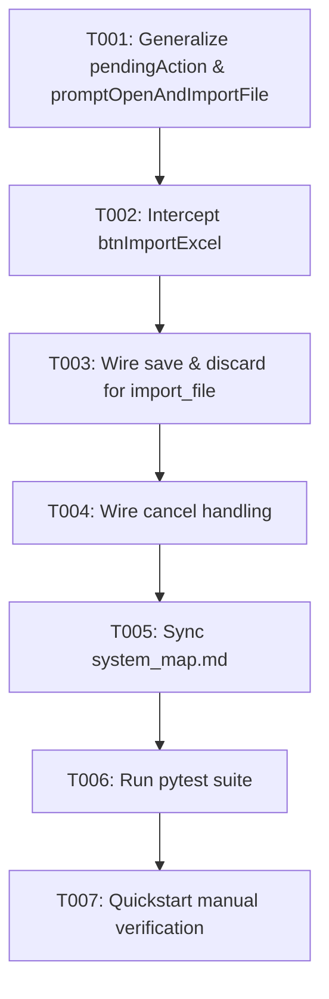

# Task Breakdown: Unsaved Changes Protection on New File Import

**Feature**: `018-unsaved-changes-prompt-on-new-file-import`  
**Branch**: `018-unsaved-changes-prompt-on-new-file-import`  
**Spec**: [specs/018-unsaved-changes-prompt-on-new-file-import/spec.md](spec.md)  
**Plan**: [specs/018-unsaved-changes-prompt-on-new-file-import/plan.md](plan.md)  

---

## Format: `[ID] [P?] [Story] Description`
- **[P]**: Can run in parallel
- **[Story]**: Target User Story (US1)

---

## Phase 1: Setup & Foundational (State Controller Architecture)

**Purpose**: Generalize modal state tracking to handle multi-trigger actions (`switch_sheet` and `import_file`).

- [x] T001 [P] Refactor `src/web/js/app.js` to introduce `this.pendingAction` (`{ type: 'switch_sheet' | 'import_file', targetSheet?: string }`) and extract `promptOpenAndImportFile()` helper

**Checkpoint**: Modal state machine is generalized to accept arbitrary pending actions.

---

## Phase 2: User Story 1 - Data Loss Prevention when Importing a New File (Priority: P1) 🎯 MVP

**Goal**: Prevent session overwrite by prompting user before importing a new file over unsaved work.

**Independent Test**: Add nodes to canvas (`isDirty == true`), click `Import Excel`, confirm modal appears. Click `Cancel`, confirm workspace is retained. Click `Save/Update & Import`, confirm file saves and open file picker immediately appears.

- [x] T002 [US1] Update `#btnImportExcel` click listener in `src/web/js/app.js` to check `isDirty`, configure `#unsavedModal` with import-specific messaging and buttons (`Save/Update Template & Import`, `Discard & Import`), and show modal when dirty
- [x] T003 [US1] Update `#btnUnsavedSave` and `#btnUnsavedDiscard` in `src/web/js/app.js` to handle `pendingAction.type === 'import_file'`, invoking `promptOpenAndImportFile()` immediately upon save or discard
- [x] T004 [US1] Update modal cancellation and close handlers in `src/web/js/app.js` to reset `pendingAction` and preserve the active workspace state

**Checkpoint**: User Story 1 is fully functional and independently testable as an MVP.

---

## Phase 3: Polish, System Map Sync & Quality Assurance

**Purpose**: Update system map and validate full automated test suite.

- [x] T005 Update [`.specify/system_map.md`](../../.specify/system_map.md) to document the import dirty state protection lifecycle
- [x] T006 Run full test suite `python -m pytest` to confirm all unit and integration tests pass cleanly with 0 failures
- [x] T007 Execute end-to-end manual verification per [`specs/018-unsaved-changes-prompt-on-new-file-import/quickstart.md`](quickstart.md)

---

## Dependencies & Execution Order

