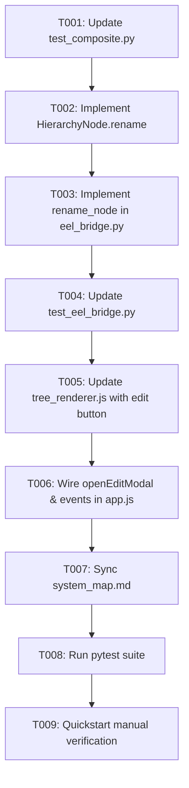

# Task Breakdown: In-Place / Modal Node Renaming in Workspace

**Feature**: `019-node-renaming-in-workspace`  
**Branch**: `019-node-renaming-in-workspace`  
**Spec**: [specs/019-node-renaming-in-workspace/spec.md](spec.md)  
**Plan**: [specs/019-node-renaming-in-workspace/plan.md](plan.md)  

---

## Format: `[ID] [P?] [Story] Description`
- **[P]**: Can run in parallel
- **[Story]**: Target User Story (US1)

---

## Phase 1: Setup & Foundational (Domain Model & TDD Unit Tests)

**Purpose**: Build and test domain-level node renaming with validation.

- [x] T001 [P] Update unit tests in `tests/unit/test_composite.py` to assert `HierarchyNode.rename(new_name)` trims whitespace and rejects empty strings
- [x] T002 Implement `rename(new_name: str)` on `HierarchyNode` in `src/hierarchy_lib/models/composite.py`

**Checkpoint**: Core domain models support safe node renaming.

---

## Phase 2: Backend RPC & Integration Tests

**Purpose**: Expose and verify Eel RPC bridge endpoint for renaming nodes.

- [x] T003 Implement `@eel.expose def rename_node(node_id: str, new_name: str) -> Dict[str, Any]` in `src/app/eel_bridge.py`
- [x] T004 Update integration tests in `tests/integration/test_eel_bridge.py` to verify `rename_node` endpoint and leaf path regeneration

**Checkpoint**: Backend RPC endpoint is verified and ready for frontend integration.

---

## Phase 3: User Story 1 - Renaming Any Node via Edit Button or Double-Click (Priority: P1) 🎯 MVP

**Goal**: Enable users to edit node names via pencil button or double-click with autofocus and keyboard shortcuts.

**Independent Test**: Create node `Finance`, click pencil button or double click, change to `Accounting`, press Enter. Confirm node updates, leaf paths update, and `isDirty` is set to true.

- [x] T005 [US1] Update `src/web/js/tree_renderer.js` to render `.btn-node-edit` pencil icon ✏️ in `.node-actions` and add double-click metadata on `.node-label`
- [x] T006 [US1] Update `src/web/js/app.js` to implement `openEditModal(nodeId, currentName)`, bind click and double-click listeners, invoke `eel.rename_node`, and mark `isDirty = true`

**Checkpoint**: User Story 1 is fully functional and independently testable as an MVP.

---

## Phase 4: Polish, System Map Sync & Quality Assurance

**Purpose**: Update system map and validate full automated test suite.

- [x] T007 Update [`.specify/system_map.md`](../../.specify/system_map.md) to document the `rename_node` RPC endpoint and UI rename controls
- [x] T008 Run full test suite `python -m pytest` to confirm all unit and integration tests pass cleanly with 0 failures
- [x] T009 Execute end-to-end manual verification per [`specs/019-node-renaming-in-workspace/quickstart.md`](quickstart.md)

---

## Dependencies & Execution Order

