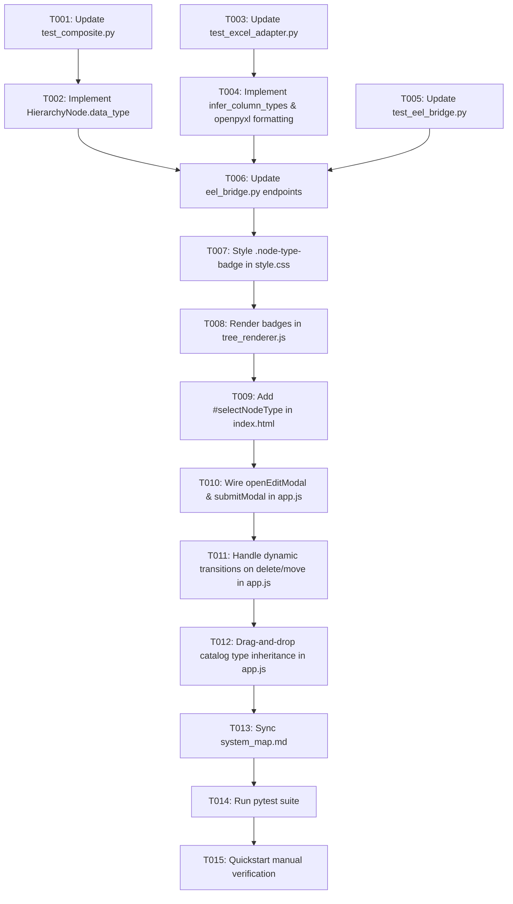

# Task Breakdown: Leaf Element Data Type Inspection, Editing, and Excel Persistence

**Feature**: `020-leaf-element-data-types`  
**Branch**: `020-leaf-element-data-types`  
**Spec**: [specs/020-leaf-element-data-types/spec.md](spec.md)  
**Plan**: [specs/020-leaf-element-data-types/plan.md](plan.md)  

---

## Format: `[ID] [P?] [Story] Description`
- **[P]**: Can run in parallel
- **[Story]**: Target User Story (US1 = Viewing/Detection, US2 = Modal Editing, US3 = Folder/Leaf Transitions, US4 = Catalog Inheritance, US5 = Export Persistence, US6 = Export Preview)

---

## Phase 1: Setup & Foundational (Domain Model & TDD Unit Tests)

**Purpose**: Establish `data_type` encapsulation, validation, and serialization in `HierarchyNode`.

- [x] T001 [P] Update unit tests in `tests/unit/test_composite.py` to assert `HierarchyNode.data_type` initialization, `set_data_type()` validation against standard Excel types, `to_dict()` serialization, and dynamic folder -> leaf conversion retaining/defaulting data type
- [x] T002 Implement `data_type` attribute, `set_data_type(data_type: str)` validation of 9 standard Excel types, and `to_dict()` serialization on `HierarchyNode` in `src/hierarchy_lib/models/node.py`

**Checkpoint**: Core domain model strictly encapsulates and validates Excel data types.

---

## Phase 2: Excel Adapter Type Inference & Formatting (Domain Library)

**Purpose**: Implement streaming type inference from cell samples and openpyxl `number_format` formatting on export.

- [x] T003 [P] Update unit tests in `tests/unit/test_excel_adapter.py` for column data type inference (`infer_column_types`) and template export cell number formatting (`export_multi_sheet_template`)
- [x] T004 Implement `infer_column_types`, `EXCEL_TYPE_FORMAT_MAP`, and update `export_multi_sheet_template` with openpyxl `number_format` formatting in `src/hierarchy_lib/adapters/excel_adapter.py`

**Checkpoint**: Excel library autonomously detects column types and writes formatted columns without MS Excel installation.

---

## Phase 3: Backend Eel RPC Bridge & Integration Tests

**Purpose**: Expose RPC endpoints for updating node data types and propagate type metadata across session operations.

- [x] T005 [P] Update integration tests in `tests/integration/test_eel_bridge.py` for `update_node` / `update_node_type`, `import_excel_file` metadata with data types, and template persistence
- [x] T006 Update `src/app/eel_bridge.py` to expose `update_node` / `update_node_type`, pass detected `headers_meta` in `import_excel_file`, and propagate leaf `data_type` in `save_template_sync` and `export_reorganized_row1`

**Checkpoint**: Backend RPC endpoints are verified and ready for frontend integration.

---

## Phase 4: User Story 1 & 2 - Viewing & Editing Leaf Element Data Types in Workspace (Priority: P1) 🎯 MVP

**Goal**: Render distinct `.node-type-badge` pills for all leaf nodes in the canvas tree and provide an "Element Data Type" dropdown in `#nodeModal`.

**Independent Test**: Create or import leaf node `Salary`, verify `[Text]` or `[Currency]` badge is rendered. Open edit modal, select `Currency`, save, and verify badge updates to `[Currency]` and `isDirty = true`.

- [x] T007 [P] [US1] Update `src/web/css/style.css` to add styling and semantic color tags for `.node-type-badge` (Currency, Date, Time, Number, Text, Boolean)
- [x] T008 [US1] Update `src/web/js/tree_renderer.js` to render `.node-type-badge` on leaf nodes (`!isFolder`) in canvas and on path cards in `renderPaths()` for `Export Preview`
- [x] T009 [US2] Update `src/web/index.html` to add `#selectNodeType` form group inside `#nodeModal` with 9 standard Excel types
- [x] T010 [US2] Update `src/web/js/app.js` to implement `openEditModal` with type dropdown pre-population (hiding/disabling for folders), `submitModal` calling `eel.update_node`, and marking `isDirty = true`

**Checkpoint**: User Stories 1 and 2 are fully functional and independently testable as an MVP.

---

## Phase 5: User Story 3 & 4 - Dynamic Folder <-> Leaf Transitions & Catalog Drag-and-Drop Inheritance (Priority: P2)

**Goal**: Support seamless dynamic folder -> leaf conversions on child deletion and inherit detected data types when dragging from Header Catalog.

**Independent Test**: Delete the only child of a folder and confirm the parent transforms into a typed leaf with badge. Drag `HireDate` from catalog and confirm new canvas node inherits `[Date]`.

- [x] T011 [US3] Update `src/web/js/app.js` to handle dynamic folder -> leaf badge transitions when deleting child nodes (`handleDeleteNode`) or moving nodes (`handleMoveNode`)
- [x] T012 [US4] Update `src/web/js/app.js` and `src/web/js/drag_drop.js` to bind detected `data_type` in catalog items and pass `data_type` when creating nodes via drag-and-drop (`handleAddHeaderNode`)

**Checkpoint**: Hierarchy restructuring and catalog drag-and-drop preserve full type fidelity.

---

## Phase 6: Polish, System Map Sync & Quality Assurance

**Purpose**: Update system map and validate full automated test suite.

- [x] T013 Update [`.specify/system_map.md`](../../.specify/system_map.md) to document `data_type`, `EXCEL_TYPE_FORMAT_MAP`, `update_node` RPC endpoint, and UI type badges
- [x] T014 Run full test suite `python -m pytest` to confirm all 50+ unit and integration tests pass cleanly with 0 failures
- [x] T015 Execute end-to-end manual verification per [`specs/020-leaf-element-data-types/quickstart.md`](quickstart.md)

---

## Dependencies & Execution Order

