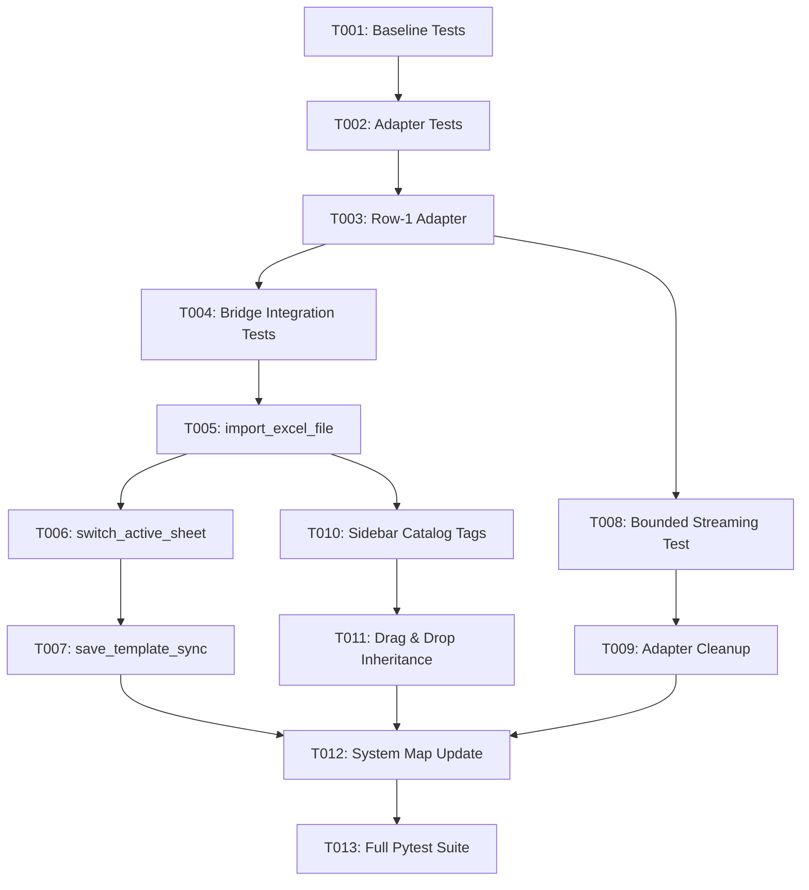

# Tasks: Pure Row-1 Streaming Excel Column Data Type Inference

**Feature Branch**: `021-excel-data-types-bug`  
**Spec**: [specs/021-excel-data-types-bug/spec.md](spec.md)  
**Plan**: [specs/021-excel-data-types-bug/plan.md](plan.md)  
**Created**: 2026-08-14

---

## Phase 1: Setup & Baseline Verification

**Purpose**: Verify project baseline and environment readiness

- [x] T001 Run existing pytest test suite to confirm clean baseline before changes

---

## Phase 2: Foundational (Type Detection & Format Classification Engine)

**Purpose**: Core Row-1 streaming reader and Excel number format mapping engine in `ExcelHierarchyAdapter`

- [x] T002 [P] Write unit tests in `tests/unit/test_excel_adapter.py` for `read_row1_headers_and_types` covering all 9 standard Excel types (Date, DateTime, Time, Currency, Percentage, Integer, Decimal, Boolean, Text) strictly on Row 1
- [x] T003 Implement `read_row1_headers_and_types` in `src/hierarchy_lib/adapters/excel_adapter.py` inspecting `cell.number_format`, `column_dimensions[col_letter].number_format`, and `cell.data_type` strictly with `max_row=1`

**Checkpoint**: Core Row-1 adapter tested and passing independently.

---

## Phase 3: User Story 1 - Row-1 Column Format Ingestion on Import (Priority: P1) 🎯 MVP

**Goal**: Ingest Excel workbooks in a single pass, populating leaf elements and sidebar catalog with detected column data types

**Independent Test**: Import an Excel workbook with configured column formats (Currency, Date, Integer, Text). Verify leaf nodes and sidebar catalog items display the correct badges and types.

### Tests for User Story 1
- [x] T004 [P] [US1] Write integration tests in `tests/integration/test_eel_bridge.py` verifying `import_excel_file` and `switch_active_sheet` populate `all_headers_meta` and leaf node `data_type` from Row 1 column formats

### Implementation for User Story 1
- [x] T005 [US1] Update `import_excel_file` in `src/app/eel_bridge.py` to use `read_row1_headers_and_types` in a single pass, populating `sheet_forests` and `all_headers_meta`
- [x] T006 [US1] Update `switch_active_sheet` in `src/app/eel_bridge.py` to maintain sheet-specific headers metadata and leaf data types
- [x] T007 [US1] Ensure `save_template_sync` in `src/app/eel_bridge.py` extracts leaf metadata and persists `number_format` strings to Row 1 via `export_multi_sheet_template`

**Checkpoint**: User Story 1 complete — Excel import dynamically detects and applies Row-1 column types.

---

## Phase 4: User Story 2 - Zero-Data-Row Streaming Bounded Performance (Priority: P2)

**Goal**: Guarantee bounded $O(1)$ memory streaming by strictly terminating after Row 1

**Independent Test**: Load a large Excel file containing 10,000+ data rows; verify execution terminates strictly on Row 1 in < 500ms.

### Implementation for User Story 2
- [x] T008 [P] [US2] Add unit test in `tests/unit/test_excel_adapter.py` verifying `read_row1_headers_and_types` stops strictly at `max_row=1` without loading row 2+
- [x] T009 [US2] Clean up and remove redundant multi-row scanning routines in `src/hierarchy_lib/adapters/excel_adapter.py` to prevent accidental multi-row loading

**Checkpoint**: User Story 2 complete — zero data rows read, sub-second execution verified.

---

## Phase 5: User Story 3 - Sidebar Catalog & Drag-and-Drop Type Fidelity (Priority: P3)

**Goal**: Ensure sidebar catalog tags display inferred types and drag-and-drop preserves types onto newly created nodes

**Independent Test**: Drag a typed item (`Currency`, `Date`) from the sidebar catalog into the canvas; verify the created node inherits that type.

### Implementation for User Story 3
- [x] T010 [P] [US3] Verify and ensure `filterAndRenderSidebar` in `src/web/js/app.js` binds detected `data-data-type` from `headers_meta`
- [x] T011 [US3] Verify `bindSidebarItem` in `src/web/js/drag_drop.js` transfers `dataType` in the drag payload to newly dropped nodes in the canvas

**Checkpoint**: User Story 3 complete — full drag-and-drop type inheritance verified.

---

## Phase 6: Polish & Verification

**Purpose**: System map synchronization, test suite validation, and regression testing

- [x] T012 Update `.specify/system_map.md` with the updated Row-1 streaming adapter method and type inspection architecture
- [x] T013 Run full automated test suite (`python -m pytest`) and verify 100% pass rate across all unit and integration tests

---

## Dependencies & Execution Order

