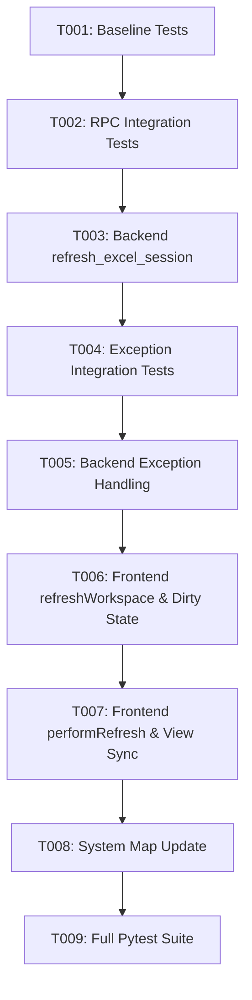

# Tasks: Refresh Imported Excel File Session

**Feature Branch**: `022-refresh-imported-excel-session`  
**Spec**: [specs/022-refresh-imported-excel-session/spec.md](spec.md)  
**Plan**: [specs/022-refresh-imported-excel-session/plan.md](plan.md)  
**Created**: 2026-08-14

---

## Phase 1: Setup & Baseline Verification

**Purpose**: Confirm clean test baseline before code modifications

- [x] T001 Run existing pytest test suite to confirm clean baseline before changes

---

## Phase 2: User Story 1 - Refresh Active Excel Session on External File Changes (Priority: P1) 🎯 MVP

**Goal**: Implement backend RPC endpoint to reconnect to and re-read the active file from disk, updating workspace and catalog

**Independent Test**: Modify an imported Excel file externally on disk and call `refresh_excel_session()`. Verify updated headers and types are returned and parsed into `sheet_forests`.

### Tests for User Story 1
- [x] T002 [P] [US1] Write integration tests in `tests/integration/test_eel_bridge.py` for `refresh_excel_session` verifying header re-reading, type detection, active sheet preservation, and active sheet fallback

### Implementation for User Story 1
- [x] T003 [US1] Implement `@eel.expose def refresh_excel_session()` in `src/app/eel_bridge.py` using streaming Row-1 header and type reading

**Checkpoint**: Backend `refresh_excel_session()` functional and passing integration tests.

---

## Phase 3: User Story 2 - Comprehensive Exception and Error Handling (Priority: P2)

**Goal**: Ensure all filesystem, lock, permission, and file format exceptions are safely handled with user-friendly messages

**Independent Test**: Call `refresh_excel_session()` when no file is loaded, when the file was deleted, or when locked. Verify structured error responses without unhandled exceptions.

### Tests for User Story 2
- [x] T004 [P] [US2] Add integration tests in `tests/integration/test_eel_bridge.py` testing `refresh_excel_session` error handling for uninitialized sessions, missing files, permission errors, and corrupted files

### Implementation for User Story 2
- [x] T005 [US2] Implement comprehensive exception handling in `refresh_excel_session()` in `src/app/eel_bridge.py` catching `FileNotFoundError`, `PermissionError`, `IOError`, `openpyxl.utils.exceptions.InvalidFileException`, and generic `Exception`

**Checkpoint**: Backend exception handling verified and robust.

---

## Phase 4: User Story 3 - Frontend UI Refresh & Dirty State Protection (Priority: P3)

**Goal**: Connect `#btnRefresh` in the UI, protect against unsaved changes via `#unsavedModal`, and update all UI views upon refresh

**Independent Test**: Click `#btnRefresh` with clean vs dirty session. Verify modal prompt on dirty state and real-time canvas/sidebar update with toast notifications.

### Implementation for User Story 3
- [x] T006 [US3] Update `refreshWorkspace()` in `src/web/js/app.js` to intercept dirty sessions via `#unsavedModal` with `pendingAction = { type: 'refresh_file' }` and handle empty sessions
- [x] T007 [US3] Update `performRefresh()` and `#unsavedModal` action handlers in `src/web/js/app.js` to call `eel.refresh_excel_session()`, update sheet selectors, tree canvas, sidebar catalog, and show toasts

**Checkpoint**: Frontend `#btnRefresh` fully interactive with dirty state protection and view synchronization.

---

## Phase 5: Polish & Verification

**Purpose**: System map synchronization, test suite validation, and regression testing

- [x] T008 Update `.specify/system_map.md` with `refresh_excel_session` RPC endpoint and frontend controller updates
- [x] T009 Run full automated test suite (`python -m pytest`) and verify 100% pass rate across all unit and integration tests

---

## Dependencies & Execution Order

