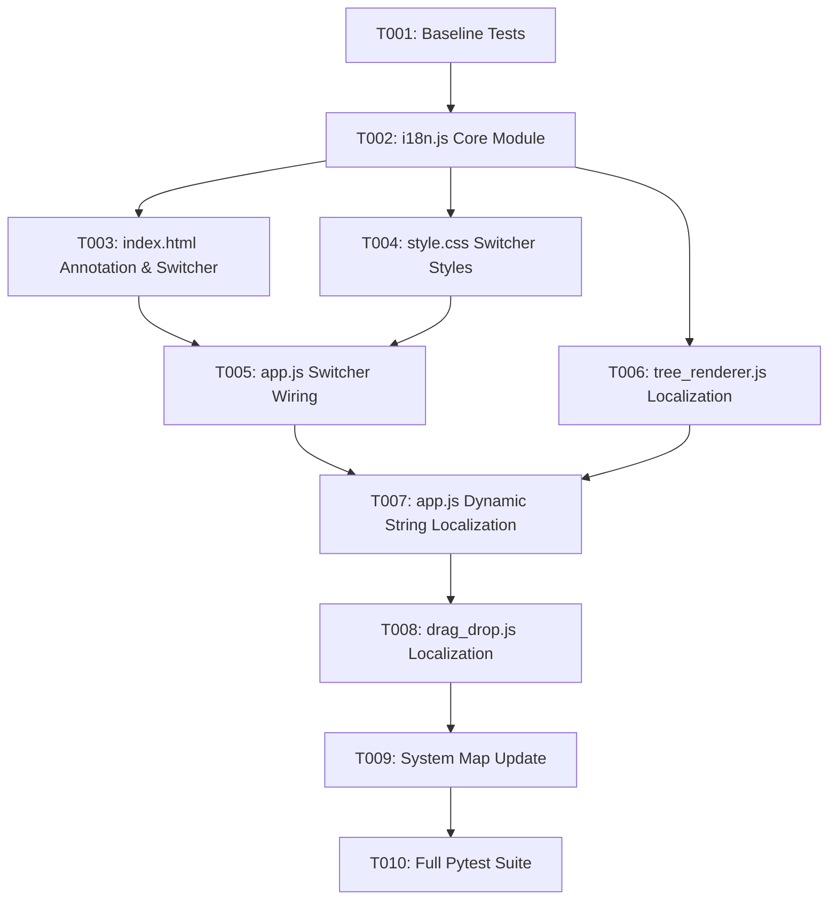

# Tasks: Multilingual Localization System (Ukrainian & English)

**Feature Branch**: `023-i18n-multilingual-support`  
**Spec**: [specs/023-i18n-multilingual-support/spec.md](spec.md)  
**Plan**: [specs/023-i18n-multilingual-support/plan.md](plan.md)  
**Created**: 2026-08-14

---

## Phase 1: Setup & Baseline Verification

**Purpose**: Confirm clean test baseline before code modifications

- [x] T001 Run existing pytest test suite to confirm clean baseline before changes

---

## Phase 2: Foundational (Translation Dictionary Asset & Engine)

**Purpose**: Core standalone `I18n` localization module and bilingual dictionary registry

- [x] T002 [P] Create `src/web/js/i18n.js` with complete `uk` and `en` translation dictionaries, `I18n.t()` parameter interpolation, `localStorage` persistence, language change subscriber mechanism, and `translateDOM()`

**Checkpoint**: Core localization registry operational and ready for UI binding.

---

## Phase 3: User Story 1 & 2 - Language Switcher UI & HTML Static Translation (Priority: P1) 🎯 MVP

**Goal**: Embed language switcher in toolbar, annotate HTML layout, and enable instant bilingual toggling

**Independent Test**: Load application, click `UA` then `EN`. Verify all static labels, tab headers, search placeholders, and buttons switch language instantly.

### Implementation for User Story 1 & 2
- [x] T003 [P] [US1] Update `src/web/index.html` to load `js/i18n.js`, add `[ UA | EN ]` segmented language switcher in `.toolbar-actions`, and annotate static elements with `data-i18n` and `data-i18n-attr`
- [x] T004 [P] [US1] Add styles for `.lang-switcher` and `.lang-btn` in `src/web/css/style.css` matching the dark design system
- [x] T005 [US1] Wire up language switcher click events and `I18n.onLanguageChanged` subscriber in `src/web/js/app.js` to synchronize active view states upon toggle

**Checkpoint**: User Story 1 complete — toolbar switcher toggles static UI between Ukrainian and English.

---

## Phase 4: User Story 3 & 4 - Dynamic Tree, Modals, Toasts & Tooltip Localization (Priority: P2 / P3)

**Goal**: Localize all dynamic tree nodes, tooltips, modal dialogs, data type dropdown options, confirmation prompts, and toast notifications

**Independent Test**: Add/edit/delete nodes and trigger toasts in both Ukrainian and English; verify 100% of dynamic strings are localized.

### Implementation for User Story 3 & 4
- [x] T006 [P] [US3] Update `src/web/js/tree_renderer.js` to use `I18n.t()` for chevron tooltips, drag handles, edit/add/delete action button titles, type badges, and empty states
- [x] T007 [US3] Update `src/web/js/app.js` to use `I18n.t()` for all modals (Create/Edit node titles, form labels, data type dropdown localized labels, folder hint), Unsaved changes modal messages/buttons, toast notifications, confirmation dialogs, and dual sheet combined header options
- [x] T008 [P] [US3] Update `src/web/js/drag_drop.js` to ensure drag & drop toast callbacks and status feedback use `I18n.t()`

**Checkpoint**: User Story 3 complete — zero hardcoded English strings in dynamic renderers, modals, or toasts.

---

## Phase 5: Polish & Verification

**Purpose**: System map synchronization, test suite validation, and regression testing

- [x] T009 Update `.specify/system_map.md` with `i18n.js` localization module and language switcher UI
- [x] T010 Run full automated test suite (`python -m pytest`) and verify 100% pass rate across all unit and integration tests

---

## Dependencies & Execution Order

