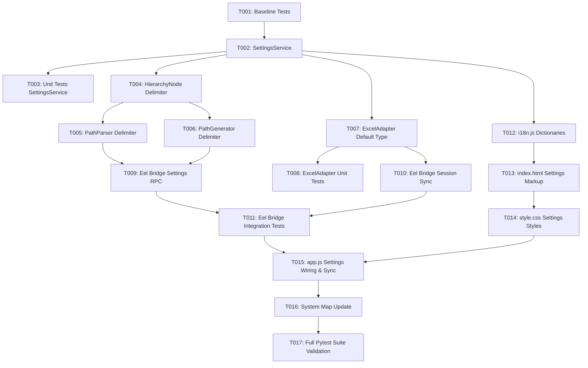

# Tasks: Settings Menu for Path Delimiter and Default Data Type Configuration

**Feature Branch**: `026-settings-menu-config`  
**Spec**: [specs/026-settings-menu-config/spec.md](spec.md)  
**Plan**: [specs/026-settings-menu-config/plan.md](plan.md)  
**Created**: 2026-08-16

---

## Phase 1: Baseline Verification

**Purpose**: Confirm clean test baseline before code modifications

- [x] T001 Run existing pytest test suite (`python -m pytest`) to confirm clean 62+ test baseline before changes

---

## Phase 2: Foundational (Backend SettingsService & Domain Delimiter Support)

**Purpose**: Core backend settings manager, `settings.json` persistence, and domain model delimiter customization

- [x] T002 [P] Create `src/hierarchy_lib/services/settings_service.py` to manage `settings.json` persistence with validation for 1–3 char delimiter and standard Excel data types
- [x] T003 [P] Create unit tests in `tests/unit/test_settings_service.py` covering default retrieval, updating, validation rejections, and resetting to defaults
- [x] T004 [P] Update `src/hierarchy_lib/models/base.py` and `src/hierarchy_lib/models/node.py` to accept configurable `delimiter: Optional[str] = None` in `get_absolute_path()` and `to_dict()`
- [x] T005 [P] Update `src/hierarchy_lib/services/path_parser.py` to accept configurable `delimiter: Optional[str] = None` in `PathParserService.parse_header_paths()`
- [x] T006 [P] Update `src/hierarchy_lib/services/path_generator.py` to accept configurable `delimiter: Optional[str] = None` in `calculate_path()` and `calculate_all_paths()`

**Checkpoint**: Core domain model and path parsing supports any custom delimiter symbol.

---

## Phase 3: User Story 2 - Excel Adapter Default Data Type Integration (Priority: P2)

**Goal**: Support configurable default data type for General/unassigned columns during Excel import

- [x] T007 [P] [US2] Update `ExcelHierarchyAdapter._map_format_to_data_type()` and `read_row1_headers_and_types()` in `src/hierarchy_lib/adapters/excel_adapter.py` to use `default_data_type` parameter (default: `"Text"`) for General/unassigned formats
- [x] T008 [P] [US2] Add unit tests in `tests/unit/test_excel_adapter.py` verifying that unformatted/General columns are assigned the configured default data type (e.g. `Decimal`, `Integer`)

---

## Phase 4: Eel RPC Bridge Integration & Session Synchronization

**Goal**: Expose settings endpoints to frontend and synchronize session sheets

- [x] T009 Expose `@eel.expose def get_settings()` and `@eel.expose def update_settings(delimiter: str, default_data_type: str)` in `src/app/eel_bridge.py`
- [x] T010 Propagate active `delimiter` and `default_data_type` through `import_excel_file()`, `refresh_excel_session()`, and `switch_active_sheet()` in `src/app/eel_bridge.py`
- [x] T011 Update integration tests in `tests/integration/test_eel_bridge.py` covering settings retrieval, updating, and recalculated tree roots

---

## Phase 5: User Story 1 & 3 - Frontend Settings Modal, UI Wiring & Bilingual Localization (Priority: P1 / P3) 🎯 MVP

**Goal**: Implement top toolbar settings button, settings modal dialog, instant real-time tree refresh, dual `localStorage` persistence, and complete bilingual localization

- [x] T012 [P] [US3] Add dictionary entries for Ukrainian (`uk`) and English (`en`) in `src/web/js/i18n.js` for all settings modal titles, labels, placeholders, help texts, buttons, and toasts
- [x] T013 [P] [US1] Add `#btnSettings` gear button in `.toolbar-actions` and `#settingsModal` dialog markup in `src/web/index.html` with `data-i18n` and `data-i18n-attr` tags
- [x] T014 [P] [US3] Add styles for `#btnSettings`, `#settingsModal`, form groups, and action buttons in `src/web/css/style.css` matching the dark design system
- [x] T015 [US1] Implement settings lifecycle, modal open/close/save/reset handlers, `localStorage` caching, keyboard shortcuts (`Enter`/`Escape`), and real-time tree & path preview refresh in `src/web/js/app.js`

**Checkpoint**: User can open settings, change delimiter and default data type, save, and see live updates immediately in both languages.

---

## Phase 6: Polish, System Map & Verification

**Purpose**: System map synchronization, test suite validation, and regression testing

- [x] T016 Update `.specify/system_map.md` documenting `SettingsService`, settings modal, and configuration workflow
- [x] T017 Run full automated test suite (`python -m pytest`) ensuring 100% pass rate across all unit and integration tests

---

## Dependencies & Execution Order

