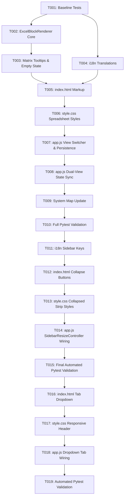

# Tasks: Excel Block Hierarchy View (Multi-Level Header Matrix Mode)

**Feature Branch**: `027-excel-block-hierarchy-view`  
**Spec**: [specs/027-excel-block-hierarchy-view/spec.md](spec.md)  
**Plan**: [specs/027-excel-block-hierarchy-view/plan.md](plan.md)  
**Created**: 2026-08-16  

---

## Phase 1: Baseline Verification

**Purpose**: Confirm clean test baseline before code modifications

- [x] T001 Run existing pytest test suite (`python -m pytest`) to confirm clean 75+ test baseline before changes

---

## Phase 2: Core Matrix Calculation & Rendering Engine (Priority: P1)

**Purpose**: Build the pure frontend layout engine translating tree hierarchies into Excel multi-tier block tables

- [x] T002 [P] Create `src/web/js/excel_block_renderer.js` with `getMaxDepth(roots)`, `getLeafCount(node)`, `getExcelColumnLabel(colIndex)`, `buildMatrixLayout(roots)`, and `renderMatrix(roots, containerEl)` generating semantic HTML `<table>` markup with coordinates `<thead>` and multi-tier `<tbody>` with proportional `colspan` and `rowspan`
- [x] T003 [P] Implement rich hover tooltip generation (node name, absolute path with active delimiter, data type, span statistics) and empty state rendering in `src/web/js/excel_block_renderer.js`

---

## Phase 3: Localization & Internationalization (Priority: P2)

**Goal**: Full bilingual support for view switcher controls, tooltips, and matrix empty states

- [x] T004 [P] [US3] Add dictionary entries for Ukrainian (`uk`) and English (`en`) in `src/web/js/i18n.js` for view switcher button labels, tooltips, matrix coordinates, and empty states

---

## Phase 4: HTML Markup & Dark Theme CSS Styling (Priority: P1)

**Goal**: Integrate view mode switcher and responsive spreadsheet-style block matrix into UI

- [x] T005 [P] [US1] In `src/web/index.html`, add `#viewModeSwitcher` segmented control (`#btnViewTree`, `#btnViewMatrix`) in `.workspace-sheet-picker`, add `

`, and include `js/excel_block_renderer.js` script tag
- [x] T006 [P] [US1] In `src/web/css/style.css`, add styles for `.view-mode-switcher`, `.view-mode-btn`, `.excel-block-view`, `.excel-matrix-table`, `.matrix-coord-header`, `.matrix-cell`, `.matrix-cell-folder`, `.matrix-cell-leaf`, tier shading, cell borders, and responsive horizontal scrolling

---

## Phase 5: App Controller Wiring & State Synchronization (Priority: P1 / P2) 🎯 MVP

**Goal**: Wire view switching, `localStorage` persistence, and dual-view real-time synchronization

- [x] T007 [US1] In `src/web/js/app.js`, bind `#btnViewTree`, `#btnViewMatrix`, `#excelBlockView`, and implement `switchViewMode(mode)` with `localStorage` (`je_workspace_view_mode`) preference persistence
- [x] T008 [US2] In `src/web/js/app.js`, update `updateUI(roots)` and `I18n.onLanguageChanged` observer to re-render both `TreeRenderer` and `ExcelBlockRenderer` simultaneously upon all tree edits, sheet switches, file imports, and settings changes

---

## Phase 6: System Map & Verification

**Purpose**: System map synchronization and automated regression validation

- [x] T009 Update `.specify/system_map.md` documenting `ExcelBlockRenderer` module and dual-mode workspace architecture
- [x] T010 Run full automated test suite (`python -m pytest`) ensuring 100% pass rate across all unit and integration tests

---

## Phase 7: Sidebar Collapse & Expand (Priority: P2) (Quick Fix Enhancement)

**Goal**: Implement collapsible right sidebar panel into a narrow 28px vertical strip

- [x] T011 [US4] In `src/web/js/i18n.js`, add `sidebar_btn_collapse` and `sidebar_btn_expand` translations in Ukrainian (`uk`) and English (`en`)
- [x] T012 [US4] In `src/web/index.html`, add `#btnToggleSidebarCollapse` in `.sidebar-tab-header` and `.sidebar-collapsed-strip` with `#btnExpandSidebarStrip` inside `#unifiedSidebar`
- [x] T013 [US4] In `src/web/css/style.css`, add styles for `.sidebar-collapsed` (width: 28px, collapsed strip layout, transition, button hover effects)
- [x] T014 [US4] In `src/web/js/app.js`, enhance `SidebarResizeController` to support `toggleCollapse()`, width preservation, and `localStorage` persistence (`je_sidebar_collapsed`)
- [x] T015 [US4] Run full automated test suite (`python -m pytest`) including `test_frontend_contracts.py` ensuring 100% pass rate

---

## Phase 8: Unified Sidebar Tab Dropdown & Responsive Header (Priority: P2) (Quick Fix Enhancement)

**Goal**: Merge tab buttons into a compact dropdown selector and guarantee collapse button visibility at all widths

- [x] T016 [US4] In `src/web/index.html`, replace `.sidebar-tab-btn` buttons in `.sidebar-tab-header` with `#sidebarTabSelector` dropdown containing `catalog` and `paths` options, active count badge `#sidebarActiveCountBadge`, and ensure `#btnToggleSidebarCollapse` is on the right
- [x] T017 [US4] In `src/web/css/style.css`, style `.sidebar-tab-header`, `.sidebar-tab-select-group`, `.sidebar-tab-select`, and `.sidebar-collapse-btn` ensuring `flex-shrink: 0` on collapse button and clean text truncation at minimum widths
- [x] T018 [US4] In `src/web/js/app.js`, update `bindTabs()` to listen to `change` events on `#sidebarTabSelector`, update dynamic counters, and switch active tab content panels
- [x] T019 [US4] Run full automated test suite (`python -m pytest`) including `test_frontend_contracts.py` ensuring 100% pass rate

---

## Dependencies & Execution Order

