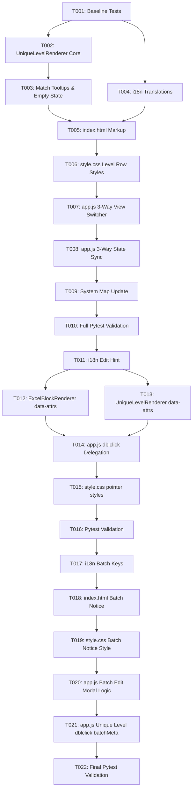

# Tasks: Unique Level Hierarchy View (Feature 028)

**Feature Branch**: `028-unique-level-hierarchy-view`  
**Spec**: [specs/028-unique-level-hierarchy-view/spec.md](spec.md)  
**Plan**: [specs/028-unique-level-hierarchy-view/plan.md](plan.md)  
**Created**: 2026-08-16  

---

## Phase 1: Baseline Verification

**Purpose**: Confirm clean test baseline before code modifications

- [x] T001 Run existing pytest test suite (`python -m pytest`) to confirm clean 80-test baseline before changes

---

## Phase 2: Core Level Deduplication & Match Engine (Priority: P1)

**Purpose**: Build the level extraction, case-insensitive deduplication, cross-level match detection, and interactive hover highlighter

- [x] T002 [P] Create `src/web/js/unique_level_renderer.js` with `extractUniqueLevels(roots)`, `renderUniqueLevels(roots, containerEl)`, and synchronized hover highlighting (`.highlight-match-sync`)
- [x] T003 [P] Implement rich tooltip generation (occurrences, level breakdown, absolute paths) and empty state rendering in `src/web/js/unique_level_renderer.js`

---

## Phase 3: Localization & Internationalization (Priority: P2)

**Goal**: Full bilingual support for 3-way view switcher, level row titles, match badges, and statistics

- [x] T004 [P] [US3] Add dictionary entries for Ukrainian (`uk`) and English (`en`) in `src/web/js/i18n.js` for view switcher label, level titles, count stats, match badges, and empty states

---

## Phase 4: HTML Markup & Dark Theme CSS Styling (Priority: P1)

**Goal**: Integrate 3rd view button, view container, and responsive horizontal stacked rows styling

- [x] T005 [P] [US1] In `src/web/index.html`, add `#btnViewUniqueLevels` in `#viewModeSwitcher`, add `

`, and include `js/unique_level_renderer.js` script tag
- [x] T006 [P] [US1] In `src/web/css/style.css`, add styles for `.unique-level-view`, `.level-row-container`, `.level-row-header`, `.level-chips-container`, `.level-header-chip`, `.has-cross-match`, and `.highlight-match-sync`

---

## Phase 5: App Controller Wiring & State Synchronization (Priority: P1 / P2) 🎯 MVP

**Goal**: Wire 3-way view switching, `localStorage` persistence, and real-time synchronization

- [x] T007 [US1] In `src/web/js/app.js`, bind `#btnViewUniqueLevels`, `#uniqueLevelView`, and update `switchViewMode(mode)` to support 3 modes (`tree`, `matrix`, `unique_levels`) with `localStorage` (`je_workspace_view_mode`) persistence
- [x] T008 [US2] In `src/web/js/app.js`, update `updateUI(roots)` and `I18n.onLanguageChanged` observer to re-render all 3 views simultaneously upon all tree edits, sheet switches, file imports, and settings changes

---

## Phase 6: System Map & Verification

**Purpose**: System map synchronization and automated regression validation

- [x] T009 Update `.specify/system_map.md` documenting `UniqueLevelRenderer` module and 3-mode workspace architecture
- [x] T010 Run full automated test suite (`python -m pytest`) including `test_frontend_contracts.py` ensuring 100% pass rate

---

## Phase 7: Double-Click Editing in Excel Blocks & Unique Level Views (Priority: P2) (Quick Fix)

**Goal**: Enable node editing via double-click in Excel Blocks and Unique Level views

- [x] T011 [US4] In `src/web/js/i18n.js`, add `tooltip_dblclick_edit` translation in Ukrainian (`uk`) and English (`en`)
- [x] T012 [US4] In `src/web/js/excel_block_renderer.js`, attach `data-node-id`, `data-node-name`, `data-data-type`, `data-is-folder` to `.matrix-cell` and append edit hint to cell tooltips
- [x] T013 [US4] In `src/web/js/unique_level_renderer.js`, attach `data-node-id`, `data-node-name`, `data-data-type`, `data-is-folder`, `data-count` to `.level-header-chip` and append edit hint to chip tooltips
- [x] T014 [US4] In `src/web/js/app.js`, add `dblclick` event listeners on `#excelBlockView` and `#uniqueLevelView` invoking `openEditModal()`
- [x] T015 [US4] In `src/web/css/style.css`, add `cursor: pointer` to `.matrix-cell` and `.level-header-chip`
- [x] T016 [US4] Run full automated test suite (`python -m pytest`) including `test_frontend_contracts.py` ensuring 100% pass rate

---

## Phase 8: Batch Editing with Notification in Unique Level View (Priority: P2) (Quick Fix)

**Goal**: Support batch editing of all same-name nodes on the level with count notice and unified save

- [x] T017 [US4] In `src/web/js/i18n.js`, add `modal_batch_edit_notice` and `toast_batch_nodes_updated` translations in `uk` and `en`
- [x] T018 [US4] In `src/web/index.html`, add `#modalBatchNotice` alert container with `#modalBatchNoticeText` inside `#nodeModal` above `#inputNodeName`
- [x] T019 [US4] In `src/web/css/style.css`, add styling for `.modal-batch-notice` (amber alert info box with icon)
- [x] T020 [US4] In `src/web/js/app.js`, enhance `openEditModal()` to handle `batchMeta` and update `submitModal()` to update all node instances on that level and display `toast_batch_nodes_updated`
- [x] T021 [US4] In `src/web/js/app.js`, update `uniqueLevelViewEl` double-click event listener to extract `data-node-ids`, `data-count`, `data-level` and pass `batchMeta` to `openEditModal()`
- [x] T022 [US4] Run full automated test suite (`python -m pytest`) including `test_frontend_contracts.py` ensuring 100% pass rate

---

## Dependencies & Execution Order

