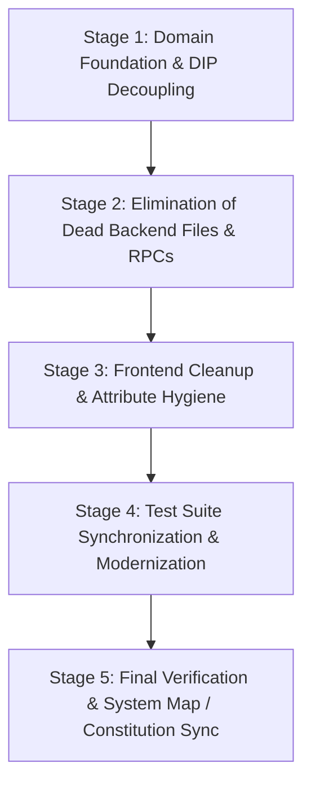

# Implementation Plan: Codebase Cleanup and SOLID Refactor

**Feature Branch**: `029-codebase-cleanup-and-solid-refactor`  
**Date**: 2026-08-16  
**Spec**: [specs/029-codebase-cleanup-and-solid-refactor/spec.md](spec.md)  
**Status**: Ready for Tasks

---

## 1. Summary & Architecture Strategy

This feature achieves complete architectural hygiene across the JE codebase by:
1. **Resolving Dependency Inversion (DIP)**: Decoupling low-level domain models (`HierarchyNode`, `WorkspaceForest`, `PathParserService`, `ExcelHierarchyAdapter`) from the concrete infrastructure service (`SettingsService`). Default values (`delimiter: str = "\\"`, `default_data_type: str = "Text"`) are used at the domain layer, while `eel_bridge.py` injects active user preferences.
2. **Centralizing Data Types (OCP)**: Establishing a single source of truth for standard Excel types in `src/hierarchy_lib/models/data_types.py`, eliminating duplicate tuples.
3. **Eliminating 19 Dead Entities & Ghost Files**:
   - Deleting obsolete model/service files: `base.py`, `composite.py`, `leaf.py`, and `path_generator.py`.
   - Deleting 7 uncalled RPC endpoints in `eel_bridge.py`: `import_excel`, `export_excel`, `rename_node`, `update_node_type`, `get_sheet_headers`, `get_workspace_tree`, `export_reorganized_row1`.
   - Deleting 4 legacy methods in `excel_adapter.py`: `import_from_file`, `export_to_file`, `infer_column_types`, `export_horizontal_row1_leaf_paths` + `Counter` import.
   - Deleting dead frontend logic: `handleExportReorganizedRow1` in `app.js`, `getTypeBadgeLabel` and `window.I18N_DICTIONARIES` in `i18n.js`, and `dataset.isContainer` in `tree_renderer.js`.
4. **Modernizing Test Suite**: Removing 3 zombie test files (`test_excel_export.py`, `test_excel_import.py`, `test_path_generator.py`) and updating contract assertions in `test_frontend_contracts.py`.
5. **Fixing Subtree Deletion Bug**: Removing redundant `isinstance(node.parent, CompositeNode)` check in `delete_node()`.
6. **Updating System Map & Constitution**: Transitioning all removed components to `🔴 Retired` in `.specify/system_map.md` and ratifying a Retirement Verification Gate in `.specify/memory/constitution.md`.

---

## 2. Technical Context

- **Language/Version**: Python 3.10+ (tested on Python 3.14) & Vanilla JavaScript (ES2022)
- **Primary Dependencies**: `eel`, `openpyxl`, standard library (`tkinter`, `json`, `os`, `uuid`, `re`)
- **Testing**: `pytest` (80 test suite target: all active tests passing, zero zombie tests)
- **Target Platform**: Windows Desktop (Chromium/Eel app wrapper)
- **Architectural Patterns**: Dynamic GoF Composite (`HierarchyNode`), Single Responsibility, Dependency Inversion, Layered Architecture

---

## 3. Constitution Check

| Principle | Requirement | Compliance Status | Strategy |
|---|---|---|---|
| **Principle I: SDD Scope Enforcement** | No source code editing during specify/plan/tasks phases | ✅ Compliant | Plan defines architecture; source edits deferred strictly to `implement` phase. |
| **Principle II: OOP & SOLID** | Strict adherence to SRP, OCP, LSP, ISP, DIP | ✅ Compliant | Directly resolves DIP (decoupling `SettingsService`) and OCP (centralizing `data_types.py`). |
| **Principle III: GoF Composite Pattern** | Dynamic `HierarchyNode` unifying folders and leaves | ✅ Compliant | Eliminates unused `base.py` and establishes `HierarchyNode` as the sole canonical composite. |
| **Principle IV: TDD & Unit Testing** | All business logic covered by passing unit tests | ✅ Compliant | Removes zombie tests for dead code; preserves 100% coverage for active code. |
| **Principle V: Self-Contained Excel** | openpyxl streaming without MS Excel requirement | ✅ Compliant | Clean multi-sheet export and Row 1 streaming preserved. |
| **Principle VI: System Map Synchronization** | Mandatory sync and proactive redundancy audit | ✅ Compliant | Updates `.specify/system_map.md` to `🔴 Retired` for all removed items. |
| **Principle VII: Red Teaming & Empty States** | Clean-slate stress testing, no user deadlocks | ✅ Compliant | Validated zero-data transitions and parent-child detachment safety. |

---

## 4. Component Changes & Contracts

### 4.1 New Domain Module: `src/hierarchy_lib/models/data_types.py`
```python
"""Centralized standard Excel column data types and validation logic."""

from typing import Tuple

VALID_DATA_TYPES: Tuple[str, ...] = (
    "Text",
    "Integer",
    "Decimal",
    "Currency",
    "Percentage",
    "Date",
    "Time",
    "DateTime",
    "Boolean",
)

def validate_data_type(data_type: str) -> str:
    """Validates and returns normalized canonical standard Excel data type string."""
    if not data_type or not str(data_type).strip():
        return "Text"
    clean = str(data_type).strip()
    for valid in VALID_DATA_TYPES:
        if clean.lower() == valid.lower():
            return valid
    raise ValueError(f"Invalid data type '{data_type}'. Expected one of: {', '.join(VALID_DATA_TYPES)}")
```

### 4.2 Decoupled Domain Models
- **`src/hierarchy_lib/models/node.py`**:
  - Remove `from src.hierarchy_lib.services.settings_service import SettingsService`.
  - Import `VALID_DATA_TYPES` and `validate_data_type` from `.data_types`.
  - Update `get_absolute_path(self, delimiter: str = "\\") -> str`.
  - Update `to_dict(self, delimiter: str = "\\") -> Dict[str, Any]`.
- **`src/hierarchy_lib/services/forest.py`**:
  - Remove `SettingsService` import.
  - Update `get_all_leaf_paths(self, delimiter: str = "\\") -> List[str]`.
  - Update `to_dict(self, delimiter: str = "\\") -> Dict[str, Any]`.
- **`src/hierarchy_lib/services/path_parser.py`**:
  - Remove `SettingsService` import.
  - Update `parse_header_paths(paths: Sequence[Optional[str]], delimiter: str = "\\") -> WorkspaceForest`.
- **`src/hierarchy_lib/adapters/excel_adapter.py`**:
  - Remove `SettingsService` import and `Counter` import.
  - Update `_map_format_to_data_type(..., default_data_type: str = "Text")`.
  - Update `read_row1_headers_and_types(..., default_data_type: str = "Text")`.
  - Delete `import_from_file`, `export_to_file`, `infer_column_types`, `export_horizontal_row1_leaf_paths`.

### 4.3 Cleaned RPC Bridge (`src/app/eel_bridge.py`)
- Remove dead RPC functions: `import_excel`, `export_excel`, `rename_node`, `update_node_type`, `get_sheet_headers`, `get_workspace_tree`, `export_reorganized_row1`.
- Update `delete_node(node_id: str)`:
  ```python
  if node.parent:
      node.parent.remove_child(node.id)
  else:
      forest.remove_root(node.id)
  ```
- Retain active RPCs: `get_settings`, `update_settings`, `reset_settings`, `add_node`, `move_node`, `delete_node`, `update_node`, `import_excel_file`, `refresh_excel_session`, `switch_active_sheet`, `save_template_sync`, `open_file_dialog`, `save_file_dialog`.

### 4.4 Cleaned Frontend Scripts (`src/web/js/`)
- **`app.js`**: Delete unused `handleExportReorganizedRow1` method.
- **`i18n.js`**: Delete `getTypeBadgeLabel()` method and remove `window.I18N_DICTIONARIES = I18N_DICTIONARIES;`.
- **`tree_renderer.js`**: Remove `wrapper.dataset.isContainer = isFolder;` on line 42.

### 4.5 Updated Test Suites (`tests/`)
- Delete `tests/unit/test_excel_export.py`.
- Delete `tests/unit/test_excel_import.py`.
- Delete `tests/unit/test_path_generator.py`.
- Update `tests/unit/test_composite.py` to import `HierarchyNode` directly (remove `CompositeNode`/`LeafNode` references).
- Update `tests/unit/test_excel_adapter.py` to remove tests for deleted methods (`test_infer_column_types_from_excel_cells`, `test_export_horizontal_row1_leaf_paths`).
- Update `tests/unit/test_frontend_contracts.py` to remove assertion for `getTypeBadgeLabel`.
- Update `tests/integration/test_eel_bridge.py` to remove tests for deleted RPCs (`test_eel_import_export_excel`, `test_eel_rename_node`, `test_eel_add_and_get_workspace_tree`).

---

## 5. Execution Stages & Verification Plan



1. **Stage 1**: Create `data_types.py`, refactor `node.py`, `forest.py`, `path_parser.py`, and `settings_service.py` to decouple from `SettingsService`.
2. **Stage 2**: Delete `base.py`, `composite.py`, `leaf.py`, `path_generator.py`, prune dead methods in `excel_adapter.py`, fix `delete_node` in `eel_bridge.py`, and prune dead RPC endpoints.
3. **Stage 3**: Clean `app.js`, `i18n.js`, and `tree_renderer.js`.
4. **Stage 4**: Delete zombie test files, update `test_composite.py`, `test_excel_adapter.py`, `test_frontend_contracts.py`, `test_eel_bridge.py`. Run `python -m pytest` to verify 100% pass rate.
5. **Stage 5**: Update `.specify/system_map.md` and `.specify/memory/constitution.md`.
