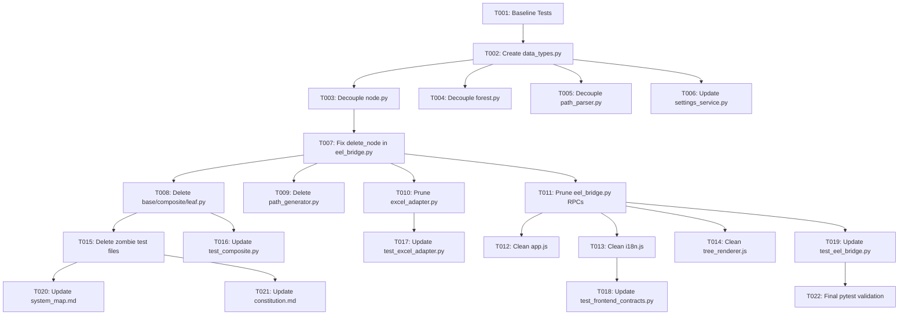

# Tasks: Codebase Cleanup and SOLID Refactor

**Feature Branch**: `029-codebase-cleanup-and-solid-refactor`  
**Spec**: [specs/029-codebase-cleanup-and-solid-refactor/spec.md](spec.md)  
**Plan**: [specs/029-codebase-cleanup-and-solid-refactor/plan.md](plan.md)  
**Created**: 2026-08-16  
**Status**: Completed

---

## Phase 1: Baseline Test Verification

**Purpose**: Confirm clean test baseline before executing refactoring tasks

- [x] T001 Run existing pytest test suite (`python -m pytest`) to confirm clean 80-test baseline before changes

---

## Phase 2: User Story 1 - Centralize Data Types & Decouple Domain from SettingsService (Priority: P1) 🎯 MVP

**Goal**: Establish single source of truth for standard Excel types, decouple models from `SettingsService` (DIP), and fix `delete_node`

- [x] T002 [P] [US1] Create `src/hierarchy_lib/models/data_types.py` with centralized `VALID_DATA_TYPES` tuple and `validate_data_type()` function
- [x] T003 [P] [US1] Update `src/hierarchy_lib/models/node.py` to import `VALID_DATA_TYPES` and `validate_data_type` from `.data_types`, remove `SettingsService` import, and set default `delimiter: str = "\\"` in `get_absolute_path()` and `to_dict()`
- [x] T004 [P] [US1] Update `src/hierarchy_lib/services/forest.py` to remove `SettingsService` import and set default `delimiter: str = "\\"` in `get_all_leaf_paths()` and `to_dict()`
- [x] T005 [P] [US1] Update `src/hierarchy_lib/services/path_parser.py` to remove `SettingsService` import and set default `delimiter: str = "\\"` in `parse_header_paths()`
- [x] T006 [P] [US1] Update `src/hierarchy_lib/services/settings_service.py` to import `VALID_DATA_TYPES` from `src.hierarchy_lib.models.data_types`
- [x] T007 [US1] Update `delete_node()` in `src/app/eel_bridge.py` to directly call `node.parent.remove_child(node.id)` without `isinstance` checks

**Checkpoint**: Core domain models are completely decoupled from `SettingsService` and data types have a single canonical source of truth.

---

## Phase 3: User Story 2 - Elimination of Dead Backend Models, RPC Endpoints & Adapter Wrappers (Priority: P2)

**Goal**: Remove obsolete files, unused Eel RPC endpoints, and legacy Excel adapter methods

- [x] T008 [US2] Delete obsolete model files `src/hierarchy_lib/models/base.py`, `src/hierarchy_lib/models/composite.py`, and `src/hierarchy_lib/models/leaf.py`
- [x] T009 [US2] Delete obsolete service file `src/hierarchy_lib/services/path_generator.py`
- [x] T010 [US2] Prune dead methods and imports in `src/hierarchy_lib/adapters/excel_adapter.py`: remove `import_from_file`, `export_to_file`, `infer_column_types`, `export_horizontal_row1_leaf_paths`, unused `Counter` import, and `SettingsService` import (default `default_data_type: str = "Text"`)
- [x] T011 [US2] Prune dead RPC endpoints in `src/app/eel_bridge.py`: remove `import_excel`, `export_excel`, `rename_node`, `update_node_type`, `get_sheet_headers`, `get_workspace_tree`, and `export_reorganized_row1`

---

## Phase 4: User Story 2 - Frontend Dead Code & Dataset Cleanup (Priority: P2)

**Goal**: Clean up uncalled methods, redundant global exports, and obsolete DOM dataset attributes

- [x] T012 [P] [US2] Delete unused method `handleExportReorganizedRow1` from `src/web/js/app.js`
- [x] T013 [P] [US2] Delete unused method `getTypeBadgeLabel` and `window.I18N_DICTIONARIES` global export from `src/web/js/i18n.js`
- [x] T014 [P] [US2] Remove obsolete attribute `wrapper.dataset.isContainer = isFolder;` from `src/web/js/tree_renderer.js`

---

## Phase 5: User Story 3 - Test Suite Modernization & Zombie Test Deletion (Priority: P2)

**Goal**: Delete zombie test files and modernize unit/integration tests to match active APIs

- [x] T015 [US3] Delete zombie test files `tests/unit/test_excel_export.py`, `tests/unit/test_excel_import.py`, and `tests/unit/test_path_generator.py`
- [x] T016 [P] [US3] Update `tests/unit/test_composite.py` to import `HierarchyNode` directly and remove `CompositeNode`/`LeafNode` references
- [x] T017 [P] [US3] Update `tests/unit/test_excel_adapter.py` to remove test cases for deleted methods (`test_infer_column_types_from_excel_cells`, `test_export_horizontal_row1_leaf_paths`)
- [x] T018 [P] [US3] Update `tests/unit/test_frontend_contracts.py` to remove assertion for `getTypeBadgeLabel`
- [x] T019 [US3] Update `tests/integration/test_eel_bridge.py` to remove tests for deleted RPCs (`test_eel_import_export_excel`, `test_eel_rename_node`, `test_eel_add_and_get_workspace_tree`) and add test for `delete_node()` with parent

---

## Phase 6: User Story 4 - System Map & Constitution Synchronization (Priority: P3)

**Goal**: Document retired components and ratify the Retirement Verification Gate

- [x] T020 [P] [US4] Update `.specify/system_map.md` to mark all deleted components, endpoints, and wrappers as `🔴 Retired`
- [x] T021 [P] [US4] Update `.specify/memory/constitution.md` to ratify Principle VI Retirement Verification Gate
- [x] T022 Run `python -m pytest` to verify 100% test pass rate across all active test suites

---

## Dependencies & Execution Order

