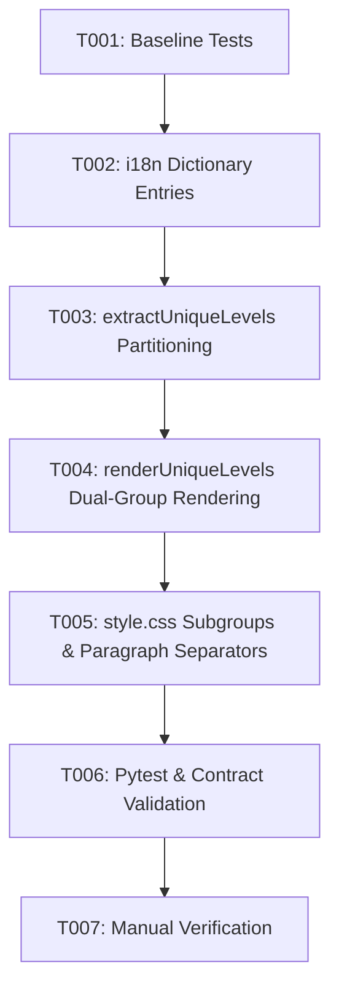

# Tasks: Leaf-First Partitioning & Paragraph Separation in Unique Level View (Feature 030)

**Feature Branch**: `030-unique-levels-leaf-grouping`  
**Spec**: [specs/030-unique-levels-leaf-grouping/spec.md](spec.md)  
**Plan**: [specs/030-unique-levels-leaf-grouping/plan.md](plan.md)  
**Created**: 2026-08-16  

---

## Phase 1: Baseline Verification

**Purpose**: Confirm clean test baseline before modifying code

- [x] T001 Run automated pytest test suite (`python -m pytest`) to confirm clean 77-test baseline before changes

---

## Phase 2: Localization & Internationalization (Priority: P2)

**Goal**: Full bilingual support for sub-group titles, badges, and counters in Ukrainian and English

- [x] T002 [US3] Add dictionary entries for Ukrainian (`uk`) and English (`en`) in `src/web/js/i18n.js` for `level_subgroup_leaves`, `level_subgroup_branches`, `level_subgroup_leaves_badge`, `level_subgroup_branches_badge`, `chip_leaf_tag`, and `chip_branch_tag`

---

## Phase 3: Core Level Extraction & Partitioning Engine (Priority: P1) 🎯 MVP

**Goal**: Implement leaf-first classification, dual-array partitioning, paragraph separation, and rendering

- [x] T003 [US1] In `src/web/js/unique_level_renderer.js`, update `extractUniqueLevels(roots)` to accurately classify terms as leaf vs branch across instances, partition into `leafItems` and `branchItems` sorted alphabetically, and return row metadata with `leafCount` and `branchCount`
- [x] T004 [US1] [US2] In `src/web/js/unique_level_renderer.js`, update `renderUniqueLevels(roots, containerEl)` to render the leaf sub-group first, render `.level-group-separator` when both groups exist, render branch sub-group second, and omit dangling dividers on all-leaf or all-branch levels while preserving all `data-*` attributes and hover sync

---

## Phase 4: CSS Dark Theme Styling (Priority: P1)

**Goal**: Implement modern dark theme styling for sub-groups, sub-headers, pill badges, and paragraph dividers

- [x] T005 [US1] In `src/web/css/style.css`, add styles for `.level-subgroups-wrapper`, `.level-subgroup`, `.level-group-leaves`, `.level-group-branches`, `.level-subgroup-header`, `.level-subgroup-title`, `.level-subgroup-pill`, and `.level-group-separator`

---

## Phase 5: Verification & Contract Tests

**Purpose**: Regression testing and contract validation

- [x] T006 Run automated pytest test suite (`python -m pytest`) including `test_frontend_contracts.py` to ensure 100% pass rate, i18n parity, and zero regressions
- [x] T007 Perform manual verification across empty, all-leaf, all-branch, and mixed multi-level trees in `Unique by Levels` view

---

## Dependencies & Execution Order

