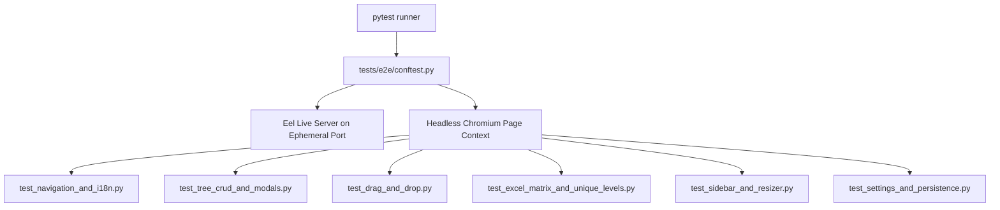

# Data Model & Test Architecture: Playwright E2E Suite

**Feature Branch**: `031-playwright-e2e-testing`  
**Created**: 2026-08-16  
**Status**: Draft  

---

## 1. E2E Test Suite Architecture



---

## 2. Test Fixture & Server Contracts

```python
# tests/e2e/conftest.py contract

import pytest
import socket
import threading
import time
import eel
from playwright.sync_api import sync_playwright

def get_free_port() -> int:
    with socket.socket(socket.AF_INET, socket.SOCK_STREAM) as s:
        s.bind(('', 0))
        return s.getsockname()[1]

@pytest.fixture(scope="session")
def eel_server():
    port = get_free_port()
    # Start Eel backend in background thread
    server_thread = threading.Thread(
        target=lambda: eel.start('index.html', mode=False, port=port, block=True),
        daemon=True
    )
    server_thread.start()
    time.sleep(1.0) # Wait for socket to bind
    yield f"http://localhost:{port}"

@pytest.fixture
def page(eel_server):
    with sync_playwright() as p:
        browser = p.chromium.launch(headless=True)
        context = browser.new_context(viewport={"width": 1280, "height": 800})
        pg = context.new_page()
        pg.goto(f"{eel_server}/index.html")
        pg.wait_for_load_state("networkidle")
        yield pg
        browser.close()
```
