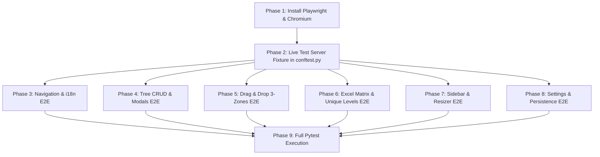

# Implementation Plan: Full Project Playwright E2E Automated Testing Suite

**Feature Branch**: `031-playwright-e2e-testing`  
**Created**: 2026-08-16  
**Status**: Ready  
**Spec**: [specs/031-playwright-e2e-testing/spec.md](spec.md)  
**Data Model**: [specs/031-playwright-e2e-testing/data-model.md](data-model.md)  
**Checklist**: [specs/031-playwright-e2e-testing/checklists/requirements.md](checklists/requirements.md)  
**Research**: [specs/031-playwright-e2e-testing/research.md](research.md)  

---

## 1. Architecture & Design Overview

This feature establishes an automated, visual browser testing pipeline using **Playwright for Python** (`pytest-playwright`). It tests the live Eel application in a real browser engine to guarantee that every button, input, modal, drag-and-drop gesture, and view mode works seamlessly.

---

## 2. Implementation Phases

### Phase 1: Environment & Dependencies Setup
- Install `pytest-playwright` and `playwright`.
- Download Chromium browser binary via `playwright install chromium`.
- Update `requirements.txt` and `pytest.ini`.

### Phase 2: Live Test Server & Browser Fixture Infrastructure (`tests/e2e/conftest.py`)
- Implement `get_free_port()` helper.
- Implement session-scoped `eel_server` fixture that boots Eel on an ephemeral port in a daemon thread.
- Implement function-scoped `page` fixture that launches Chromium in visual (headed) mode with isolated state.
- Add helpers for drag-and-drop coordinate interpolation and toast visibility detection.

### Phase 3: Navigation & Bilingual Localization E2E (`tests/e2e/test_navigation_and_i18n.py`)
- Test clicking `#langBtnUk` and `#langBtnEn` toggles active styles and re-translates all page text.
- Test `#btnRefresh` workspace refresh and toast alert.
- Test template status badge initialization.

### Phase 4: Tree Hierarchy CRUD & Folder Chevrons E2E (`tests/e2e/test_tree_crud_and_modals.py`)
- Test empty state `#btnCreateRootEmpty` and header `#btnAddRootHeader` opening `#nodeModal`.
- Test typing node name, selecting data type, submitting, and verifying DOM node creation.
- Test adding child nodes via `.action-btn.add-child`, converting parent to folder with `.node-toggle`.
- Test folder collapse and expand chevron rotation (180ms ease).
- Test `#btnExpandAll` and `#btnCollapseAll` toolbar buttons.
- Test renaming via double-click on title and clicking `.action-btn.rename-node`.
- Test deleting nodes via `.action-btn.delete` with browser `dialog` confirmation handling.

### Phase 5: Drag-and-Drop Gestures Across All 3 Zones E2E (`tests/e2e/test_drag_and_drop.py`)
- Test dragging column cards from `#sidebarHeaderList` to tree nodes.
- Test drop zone classes: `.drop-zone-before`, `.drop-zone-after`, `.drop-zone-inside`.
- Test tree node reordering.
- Test cycle detection prohibition (`.drop-prohibited`).

### Phase 6: Multi-View Modes (Excel Matrix & Unique Levels) E2E (`tests/e2e/test_excel_matrix_and_unique_levels.py`)
- Test switching to `#excelBlockView` via `#btnViewMatrix`: verify coordinate header row 1, tier backgrounds, and cell double-click edit.
- Test switching to `#uniqueLevelView` via `#btnViewUniqueLevels`: verify level row containers, leaf-first partitioning, paragraph divider line, branch sub-group, and synchronized hover highlighting (`.highlight-match-sync`).

### Phase 7: Sidebar, Search & Resizer E2E (`tests/e2e/test_sidebar_and_resizer.py`)
- Test `#sidebarTabSelector` switching between Catalog and Export Preview.
- Test `#sidebarSearch` real-time filtering of catalog columns.
- Test `#sidebarResizer` dragging to resize panel width, and double-click to reset.
- Test `#btnToggleSidebarCollapse` collapsing to strip and `#btnExpandSidebarStrip` expanding.

### Phase 8: Settings Modal, Delimiter & Disk Persistence E2E (`tests/e2e/test_settings_and_persistence.py`)
- Test clicking `#btnSettings`, editing `#inputSettingDelimiter` (`/`) and `#selectSettingDefaultType` (`Integer`).
- Test `#btnSettingsSave`, toast feedback, and path updates in `#pathList`.
- Test `settings.json` file persistence on disk and re-reading upon browser reload.
- Test `#btnSettingsReset` resetting settings to defaults.

### Phase 9: Full Suite Execution & CI Validation
- Execute full test suite (`python -m pytest`) verifying 100% pass rate across both backend unit tests and Playwright E2E browser tests.

---

## 3. File Impact Matrix

| File | Change Type | Purpose |
|---|---|---|
| `requirements.txt` | **Modify** | Add `pytest-playwright` and `playwright`. |
| `pytest.ini` | **Modify** | Add `tests/e2e` to testpaths and configure markers. |
| `tests/e2e/conftest.py` | **Create** | Live Eel server runner and Chromium browser fixture. |
| `tests/e2e/test_navigation_and_i18n.py` | **Create** | Navigation, header toolbar & language switcher E2E tests. |
| `tests/e2e/test_tree_crud_and_modals.py` | **Create** | Tree CRUD, folder chevrons & modal dialog E2E tests. |
| `tests/e2e/test_drag_and_drop.py` | **Create** | Drag-and-drop gestures across 3 zones E2E tests. |
| `tests/e2e/test_excel_matrix_and_unique_levels.py` | **Create** | Matrix view & unique level grouping E2E tests. |
| `tests/e2e/test_sidebar_and_resizer.py` | **Create** | Sidebar catalog, search & resizer splitter E2E tests. |
| `tests/e2e/test_settings_and_persistence.py` | **Create** | Settings modal, delimiter & disk persistence E2E tests. |
