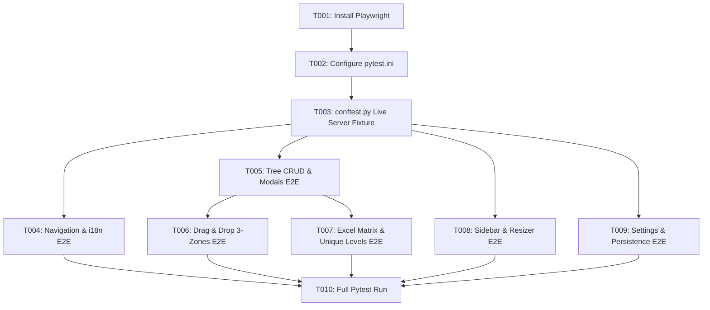

# Tasks: Full Project Playwright E2E Automated Testing Suite (Feature 031)

**Feature Branch**: `031-playwright-e2e-testing`  
**Spec**: [specs/031-playwright-e2e-testing/spec.md](spec.md)  
**Plan**: [specs/031-playwright-e2e-testing/plan.md](plan.md)  
**Created**: 2026-08-16  

---

## Phase 1: Environment & Dependencies Setup (Priority: P1)

**Goal**: Install Playwright and configure test runner

- [ ] T001 Update `requirements.txt` with `pytest-playwright` and `playwright`, install packages, and download Chromium browser binary via `playwright install chromium`
- [ ] T002 Update `pytest.ini` to include `tests/e2e` in testpaths and register the `e2e` marker

---

## Phase 2: Live Test Server & Browser Fixture Infrastructure (Priority: P1) 🎯 MVP

**Goal**: Establish live background Eel server fixture and Chromium browser context

- [ ] T003 Create `tests/e2e/conftest.py` with `eel_server` fixture running on ephemeral port, `page` fixture for headed Chromium context, console error listener, and drag-and-drop / toast helper utilities

---

## Phase 3: Navigation & Bilingual Localization E2E (Priority: P1)

**Goal**: Browser verification of language toggles, header toolbar actions, and translations

- [ ] T004 [US1] Implement `tests/e2e/test_navigation_and_i18n.py` verifying language switcher toggle (`UA` / `EN`), full DOM re-translation, refresh button toast feedback, and template badge initialization

---

## Phase 4: Tree Hierarchy CRUD & Folder Chevrons E2E (Priority: P1) 🎯 MVP

**Goal**: Browser verification of node creation, nesting, renaming, 180ms folder chevrons, and deletions

- [ ] T005 [US2] Implement `tests/e2e/test_tree_crud_and_modals.py` verifying root node creation (`#btnCreateRootEmpty`, `#btnAddRootHeader`, `#btnAddRootCanvas`), child nesting, 180ms folder chevron rotation, expand/collapse all buttons, double-click rename, and delete confirmation dialog handling

---

## Phase 5: Drag-and-Drop Gestures Across All 3 Zones E2E (Priority: P1)

**Goal**: Browser verification of mouse drag-and-drop from catalog to tree and node reordering

- [ ] T006 [US3] Implement `tests/e2e/test_drag_and_drop.py` verifying column dragging from Header Catalog onto tree nodes, 3-zone highlight detection (`BEFORE_SIBLING`, `AFTER_SIBLING`, `NEST_CHILD`), tree node reordering, and cycle detection rejection

---

## Phase 6: Multi-View Modes (Excel Matrix & Unique Levels) E2E (Priority: P2)

**Goal**: Browser verification of matrix coordinates and unique level grouping with hover sync

- [ ] T007 [US4] Implement `tests/e2e/test_excel_matrix_and_unique_levels.py` verifying view mode switcher (`#btnViewTree`, `#btnViewMatrix`, `#btnViewUniqueLevels`), coordinate header row 1, tier backgrounds, cell double-click edit, unique level rows, leaf-first partitioning, paragraph divider, branch sub-group, and synchronized hover highlighting (`.highlight-match-sync`)

---

## Phase 7: Sidebar, Search & Resizer E2E (Priority: P2)

**Goal**: Browser verification of tab switching, real-time search filtering, and resizer splitter

- [ ] T008 [US6] Implement `tests/e2e/test_sidebar_and_resizer.py` verifying catalog vs paths tab switching, real-time catalog search filtering, draggable splitter resizing with double-click reset, and collapse/expand strip transitions

---

## Phase 8: Settings Modal, Delimiter & Disk Persistence E2E (Priority: P2)

**Goal**: Browser verification of settings modal, delimiter propagation, and disk persistence in `settings.json`

- [ ] T009 [US5] Implement `tests/e2e/test_settings_and_persistence.py` verifying settings modal opening, delimiter input (`/`), default data type selection (`Integer`), save button toast feedback, path propagation in `#pathList`, disk persistence in `settings.json`, and `#btnSettingsReset` reset to defaults

---

## Phase 9: Full Suite Execution & CI Validation (Priority: P1)

**Goal**: Verify 100% test pass rate across all unit, integration, and E2E browser suites

- [ ] T010 Run full test suite (`python -m pytest`) verifying 100% pass rate across all 78 backend unit tests + all 6 new Playwright E2E browser suites

---

## Dependencies & Execution Order

