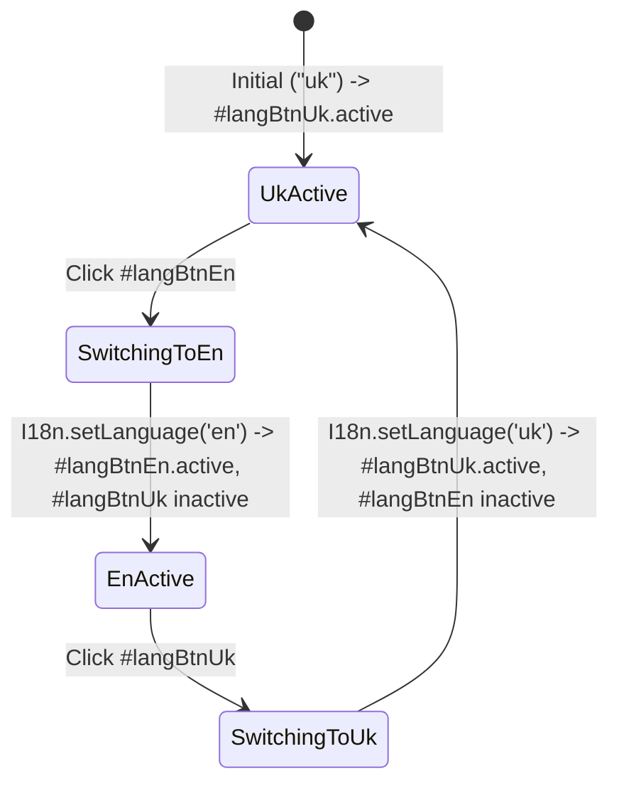
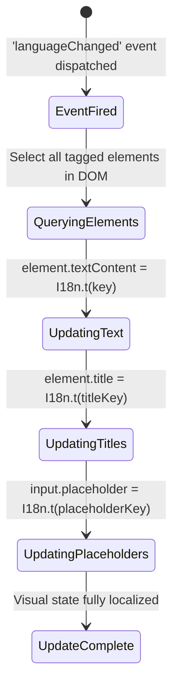
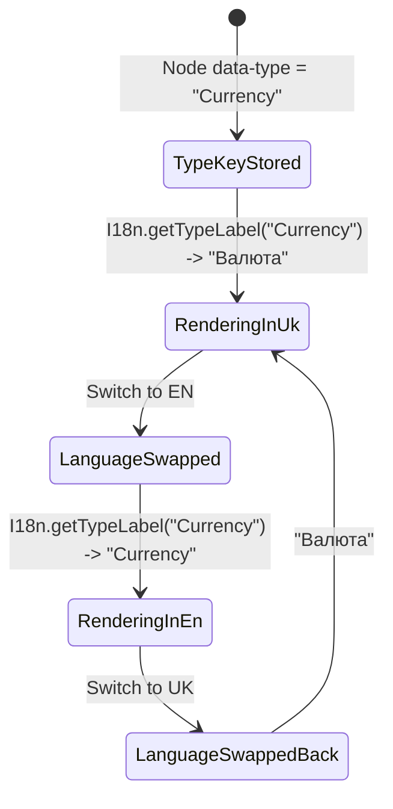

# Рівень А: Атомарні мікро-цикли елементів (i18n Micro-Lifecycles)

> **Призначення**: Автомати станів для перемикача мов, оновлення DOM-атрибутів та локалізованих бейджів.

---

## 1. `LanguageToggleLifecycle` (Життєвий цикл кнопок вибору мови)

Застосовується до: `#langBtnUk`, `#langBtnEn`.

---

## 2. `DOMTranslationTraversalLifecycle` (Життєвий цикл перекладу DOM)

Застосовується до: `document.querySelectorAll('[data-i18n], [data-i18n-title], [data-i18n-placeholder]')`.

---

## 3. `DynamicBadgeTranslatorLifecycle` (Життєвий цикл локалізації динамічних бейджів)

Застосовується до: `.type-badge` на вузлах та в сайдбарі.

