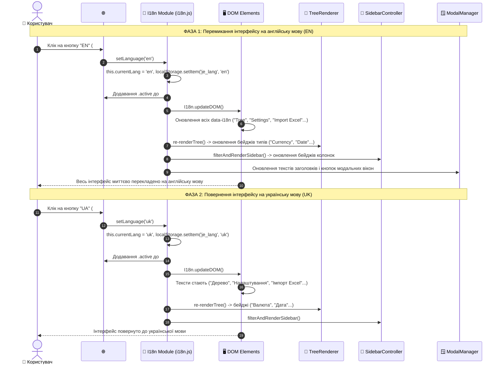

# Рівень Б: Наскрізна Sequence-діаграма локалізації (i18n Full-Stack Sequence)

> **Призначення**: Повний цикл перемикання мови між словниками `i18n.js`, оновленням усього DOM-дерева, перекладом модалок і динамічних бейджів.

---

