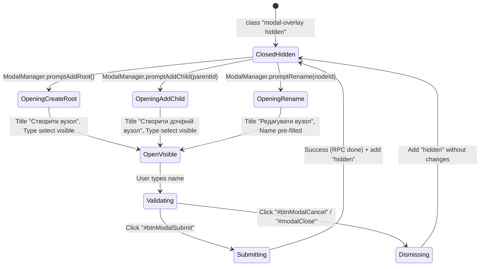
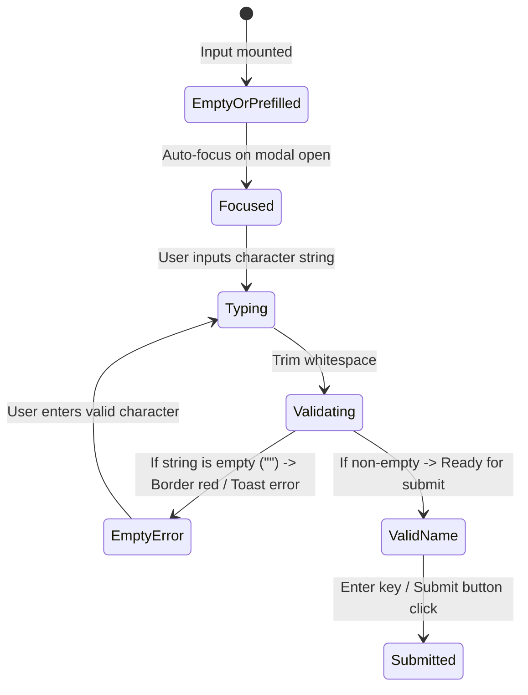
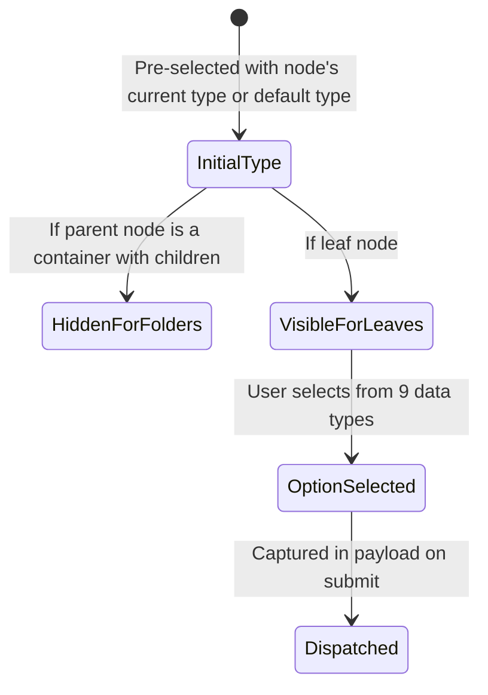
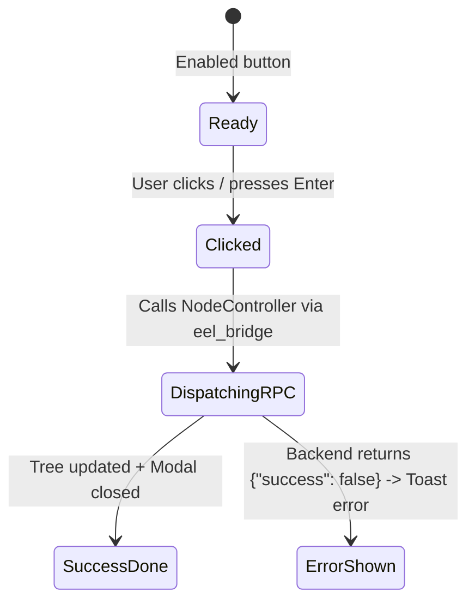

# Рівень А: Атомарні мікро-цикли елементів (Node Modal Micro-Lifecycles)

> **Призначення**: Автомати станів для окремих елементів модального вікна створення/редагування вузла (`#nodeModal`).

---

## 1. `ModalContainerLifecycle` (Життєвий цикл контейнера модалки)

Застосовується до: `#nodeModal`.

---

## 2. `NameInputValidationLifecycle` (Життєвий цикл валідації назви)

Застосовується до: `#inputNodeName`.

---

## 3. `TypeSelectLifecycle` (Життєвий цикл вибору типу даних)

Застосовується до: `#selectNodeType`.

---

## 4. `SubmitButtonLifecycle` (Життєвий цикл кнопки збереження)

Застосовується до: `#btnModalSubmit`.

