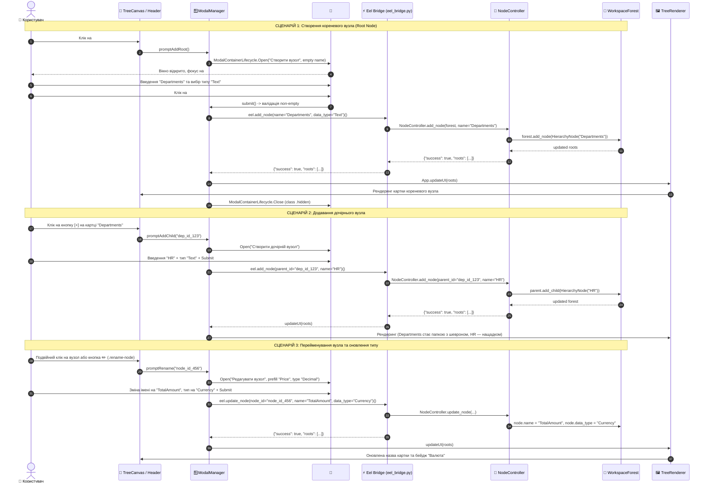

# Рівень Б: Наскрізна Sequence-діаграма модального вікна вузла (Node Modal Full-Stack Sequence)

> **Призначення**: Повний життєвий цикл створення кореневого вузла, додавання нащадка, перейменування та валідації між Frontend та Backend.

---

