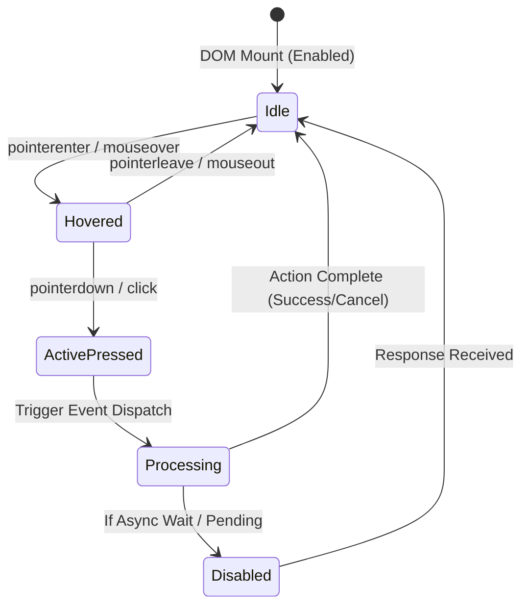
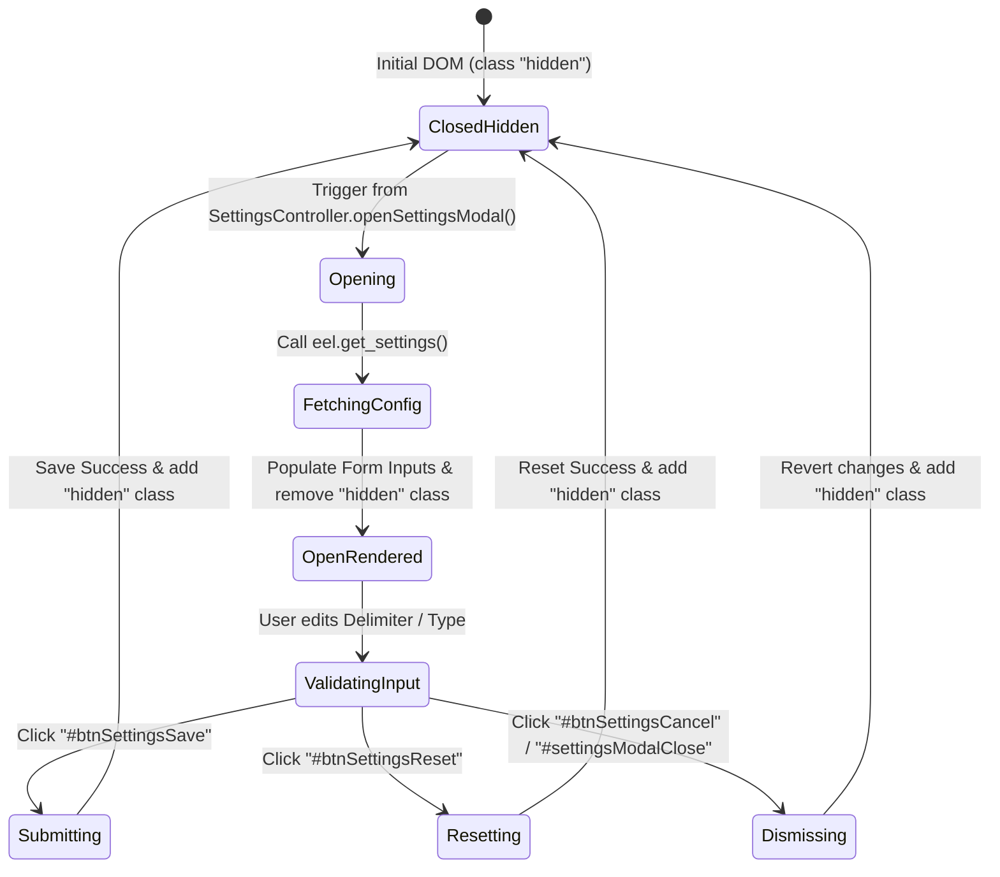
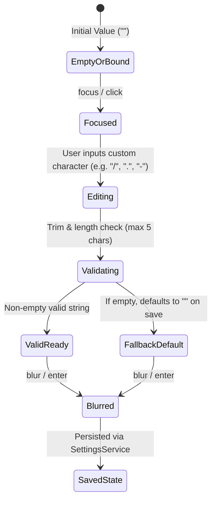
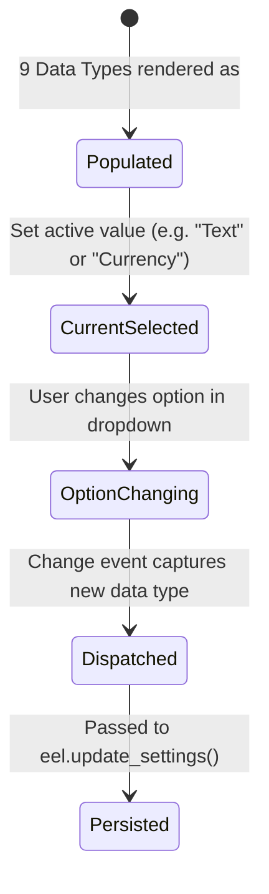
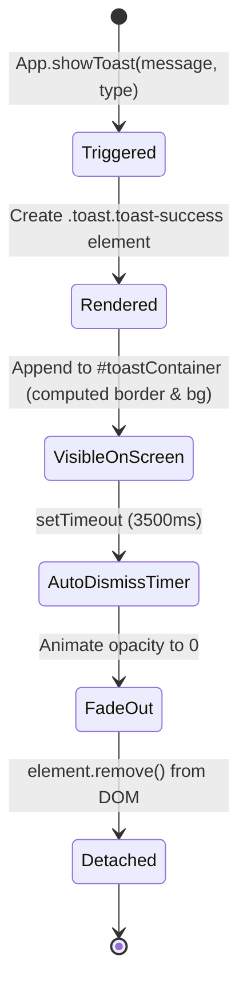

# Рівень А: Атомарні мікро-цикли елементів (Settings Micro-Lifecycles)

> **Призначення**: Кожен окремий елемент інтерфейсу розглядається як самостійний, замкнений автомат станів зі своїм повним життєвим циклом роботи.

---

## 1. `ButtonActionLifecycle` (Життєвий цикл кнопок дій)

Застосовується до: `#btnSettings`, `#btnSettingsSave`, `#btnSettingsReset`, `#btnSettingsCancel`.

- **Стани**:
  - `Idle`: Кнопка видима, готова до взаємодії (`to_be_enabled()`).
  - `Hovered`: Активується підсвічування фону/тіні (CSS `:hover`).
  - `ActivePressed`: Натиснутий стан (CSS `:active`).
  - `Processing`: Виклик асоційованого обробника події в `SettingsController`.

---

## 2. `ModalLifecycle` (Життєвий цикл модального вікна)

Застосовується до: `#settingsModal`.

- **Стани**:
  - `ClosedHidden`: Модалка має клас `modal-overlay hidden` і невидима (`not_to_be_visible()`).
  - `OpenRendered`: Клас `hidden` знято, модалка видима (`to_be_visible()`), фокус на першому полі вводу.

---

## 3. `InputControlLifecycle` (Життєвий цикл текстового поля розділювача)

Застосовується до: `#inputSettingDelimiter`.

---

## 4. `SelectDropdownLifecycle` (Життєвий цикл селектора типу за замовчуванням)

Застосовується до: `#selectSettingDefaultType`.

---

## 5. `ToastNotificationLifecycle` (Життєвий цикл спливаючого сповіщення)

Застосовується до зворотного зв'язку збереження/скидання налаштувань.

