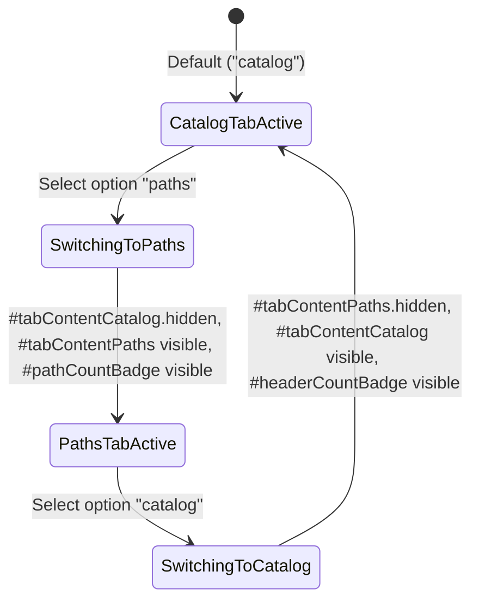
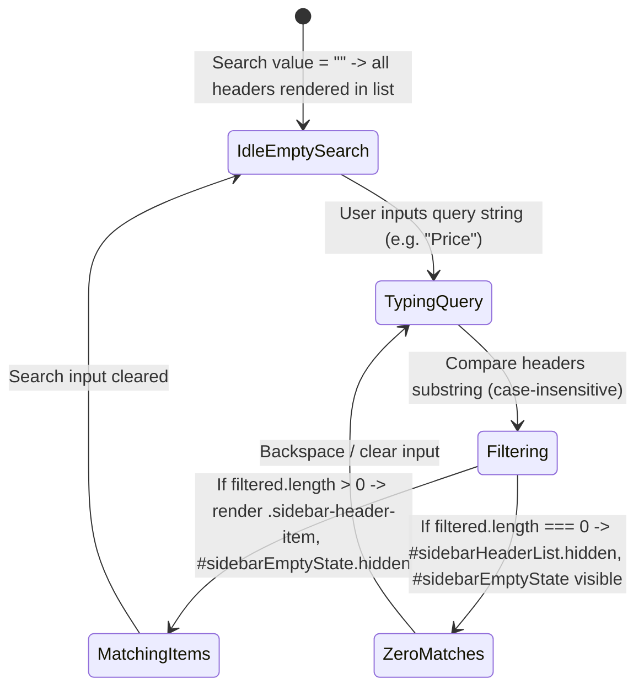
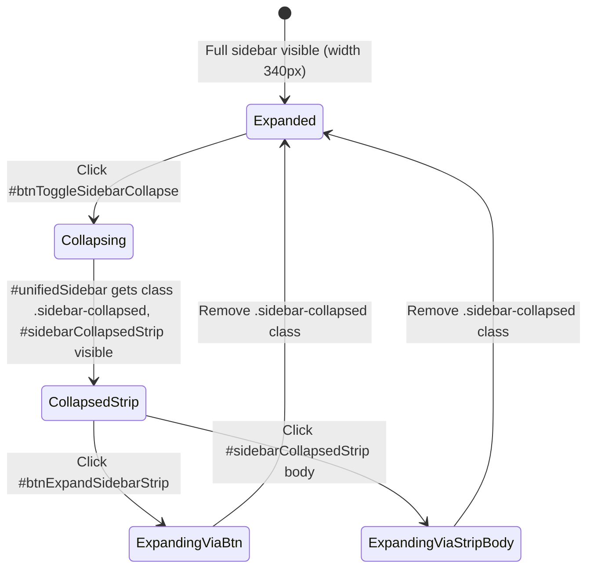
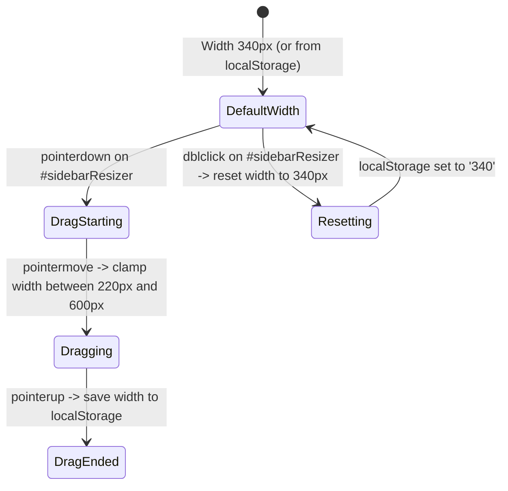

# Рівень А: Атомарні мікро-цикли елементів (Sidebar Micro-Lifecycles)

> **Призначення**: Автомати станів для вкладок, пошуку, смужки згортання, ресайзера та вибору листа каталогу.

---

## 1. `TabSelectorLifecycle` (Життєвий цикл селектора вкладок)

Застосовується до: `#sidebarTabSelector`, `#tabContentCatalog`, `#tabContentPaths`.

---

## 2. `SearchFilterLifecycle` (Життєвий цикл живого пошуку)

Застосовується до: `#sidebarSearch`, `#sidebarHeaderList`, `#sidebarEmptyState`.

---

## 3. `CollapseStripLifecycle` (Життєвий цикл згортання у смужку)

Застосовується до: `#btnToggleSidebarCollapse`, `#sidebarCollapsedStrip`, `#btnExpandSidebarStrip`.

---

## 4. `ResizerSplitterLifecycle` (Життєвий цикл ресайзера ширини)

Застосовується до: `#sidebarResizer`.

