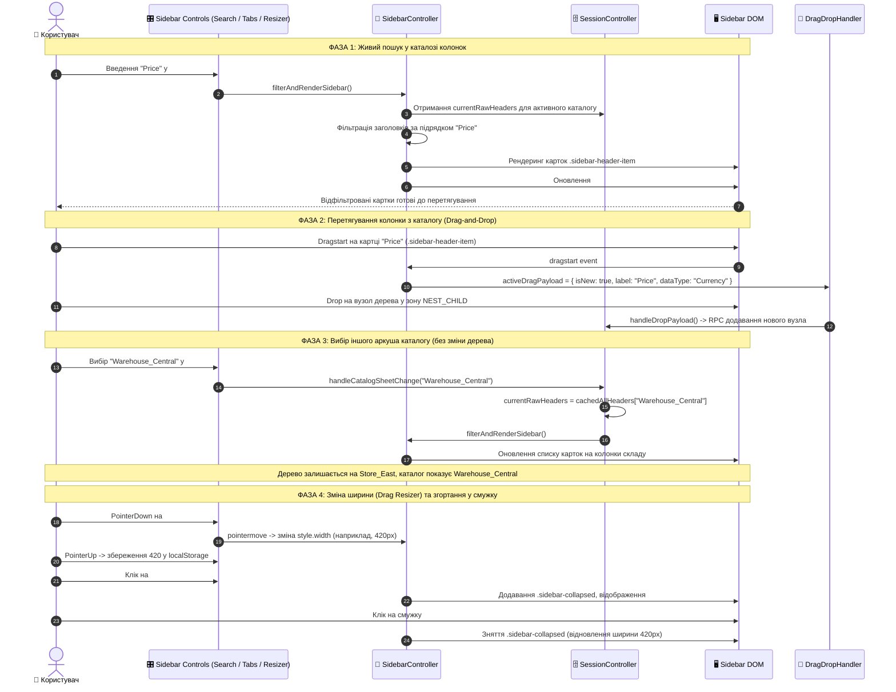

# Рівень Б: Наскрізна Sequence-діаграма сайдбару (Sidebar Full-Stack Sequence)

> **Призначення**: Повний цикл роботи бічної панелі: перемикання вкладок, пошук, ресайз, згортання та зміна аркуша каталогу.

---

