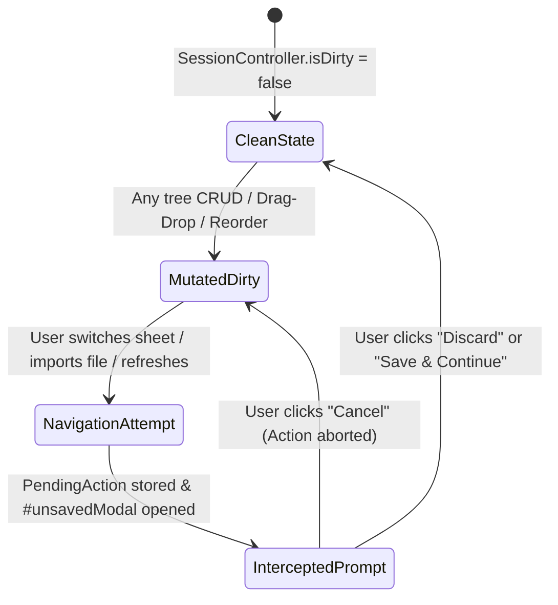
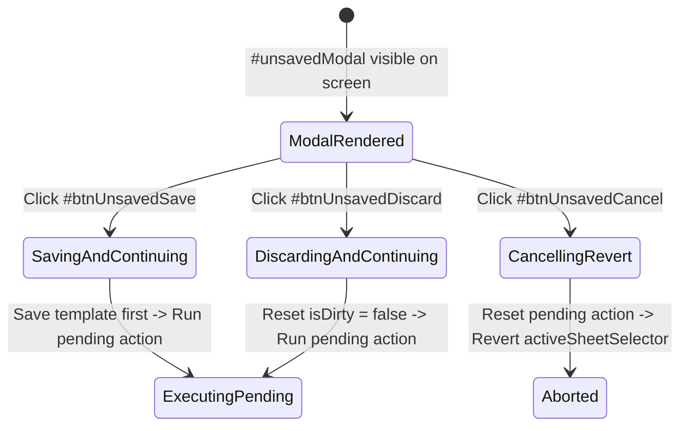
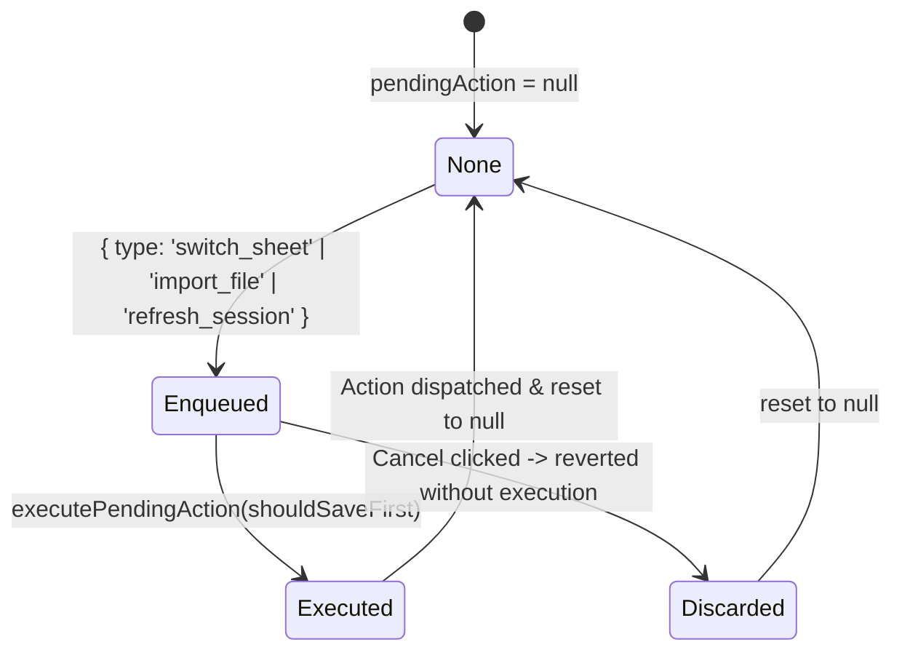

# Рівень А: Атомарні мікро-цикли елементів (Unsaved Modal Micro-Lifecycles)

> **Призначення**: Автомати станів для модального вікна захисту від незбережених змін (`#unsavedModal`).

---

## 1. `DirtyStateTriggerLifecycle` (Життєвий цикл брудного стану сесії)

Застосовується до: `SessionController.isDirty`.

---

## 2. `UnsavedModalActionLifecycle` (Життєвий цикл дій діалогу)

Застосовується до кнопок: `#btnUnsavedSave`, `#btnUnsavedDiscard`, `#btnUnsavedCancel`.

---

## 3. `PendingActionDispatcherLifecycle` (Життєвий цикл відкладеної дії)

Застосовується до: `SessionController.pendingAction`.

