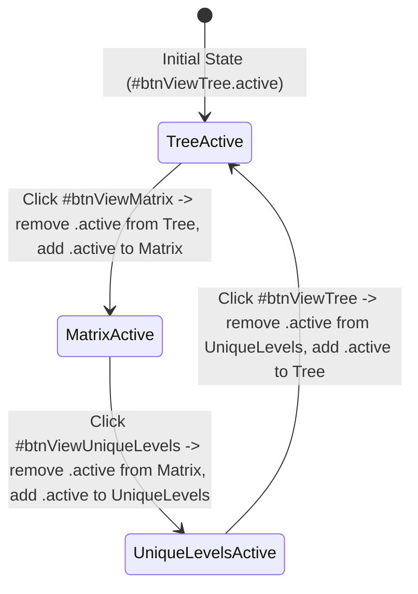
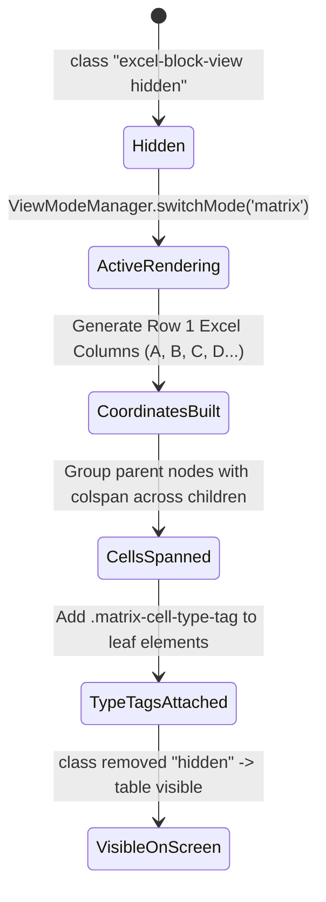
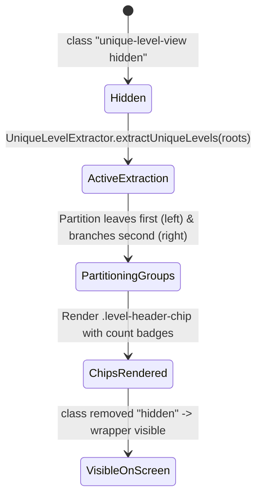
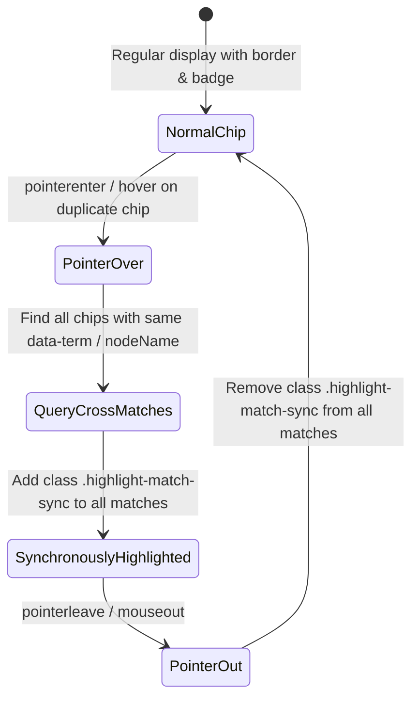

# Рівень А: Атомарні мікро-цикли елементів (View Modes Micro-Lifecycles)

> **Призначення**: Автомати станів для перемикача режимів перегляду та компонентів рендерингу.

---

## 1. `ViewModeButtonGroupLifecycle` (Життєвий цикл кнопок перемикання режимів)

Застосовується до: `#btnViewTree`, `#btnViewMatrix`, `#btnViewUniqueLevels`.

---

## 2. `MatrixCoordTableLifecycle` (Життєвий цикл таблиці блоків Excel)

Застосовується до: `#excelBlockView`, `.excel-matrix-table`.

---

## 3. `UniqueLevelChipGroupLifecycle` (Життєвий цикл пошарових чіпів)

Застосовується до: `#uniqueLevelView`, `.level-row-container`.

---

## 4. `DuplicateSyncHighlightLifecycle` (Життєвий цикл синхронного підсвічування дублікатів)

Застосовується до: `.level-header-chip` з однаковими назвами.

