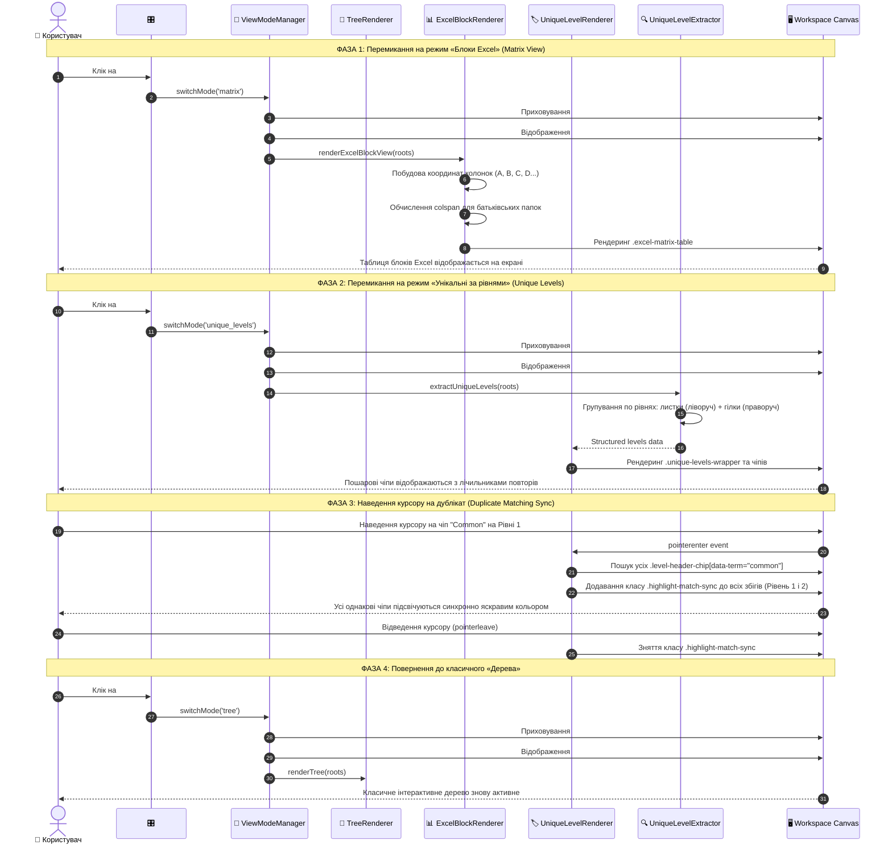

# Рівень Б: Наскрізна Sequence-діаграма режимів перегляду (View Modes Full-Stack Sequence)

> **Призначення**: Повний цикл перемикання між Деревом, Блоками Excel та Унікальними рівнями із синхронізацією підсвічування.

---

